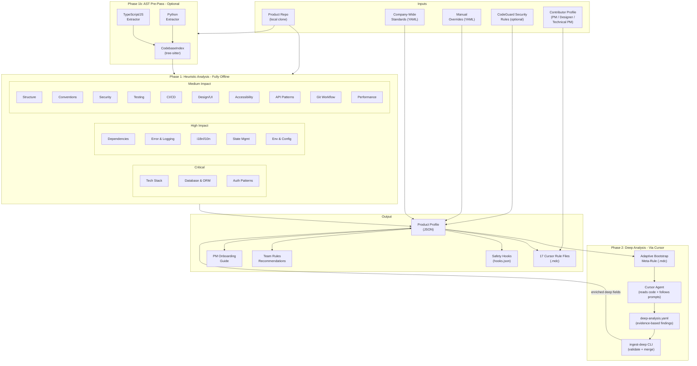
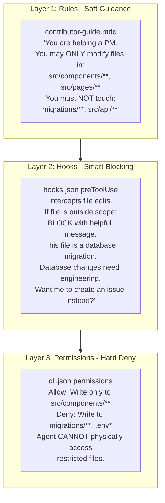
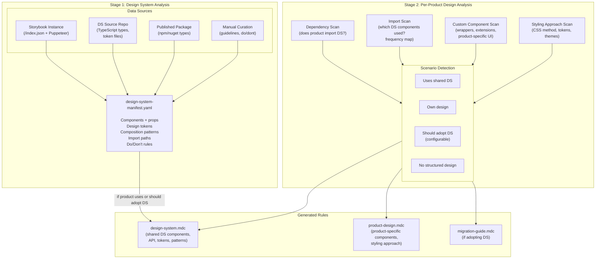
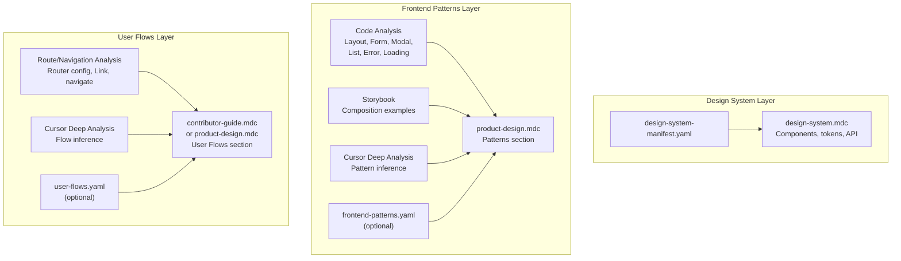
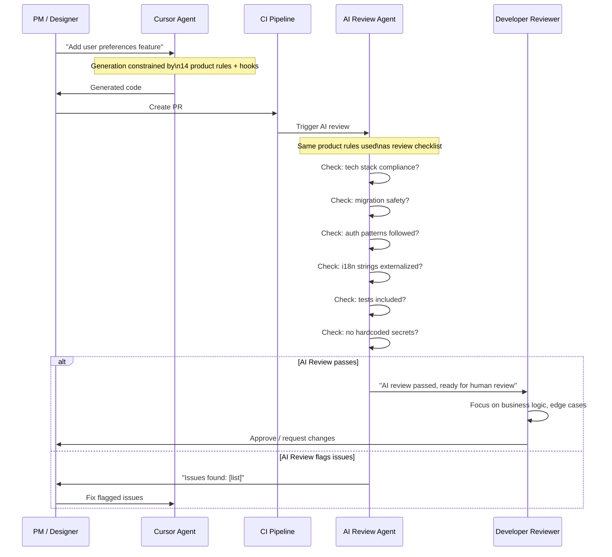
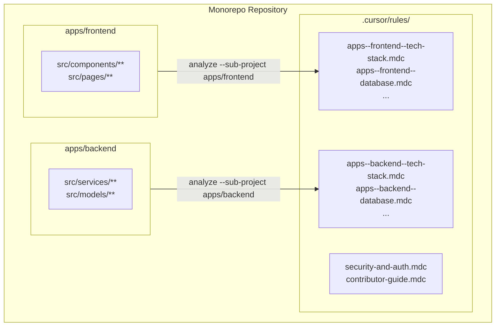
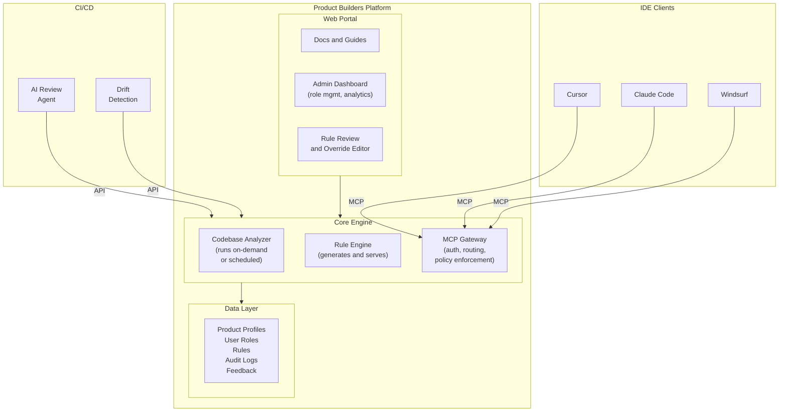

# Product Builders - Solution Architecture

> **Status**: Draft - Under review before expert validation  
> **Last updated**: Feb 23, 2026  
> **Version**: 0.7

---

# Product Builders — Specialized Agent Generator

## Problem

50+ products across diverse tech stacks and mixed Git platforms. PMs/designers need to contribute via Cursor, but the AI agent must produce code fully compatible with each product. We need a system that auto-analyzes a codebase and generates the right Cursor rules to constrain and guide the AI.

---

## Research Findings (Feb 2026)

### Existing Tools Evaluated

- **Rulefy** (npm, 27 stars): Uses repomix + Claude API to generate a single `.rules.mdc` file from a codebase. Proves the LLM approach works, but limited: single monolithic file, no company standards, no multi-product orchestration, requires Anthropic API key.
- **rules-gen** (npm, 15 stars): Interactive CLI picking from a predefined catalog. Not auto-analysis based. Good UX pattern.
- **Repomix** (npm, 21k+ stars): Packs entire codebases into AI-friendly text. Key building block used by Rulefy. Supports MCP protocol.
- **Project CodeGuard / CoSAI** (Python, 389 stars): Security rules framework with unified source format that translates to Cursor, Windsurf, Copilot, and Antigravity formats. Excellent architecture pattern.
- **stack-analyzer** (Python, 4 stars): Detects languages, frameworks, build tools, Dockerization from repos. Validates our heuristic approach.

### Cursor Enterprise Capabilities (2026)

- Rule hierarchy: Team Rules (highest, dashboard-managed) > Project Rules (`.cursor/rules/`) > User Rules
- Enforced Team Rules cannot be disabled by users — ideal for company-wide security/quality standards
- Hooks system: `preToolUse`, `postToolUse`, `beforeShellExecution`, etc. for agent governance
- Background Agent API (Beta): Programmatic agent launches via REST API for automation
- Best practices: focused rules under 500 lines, reference files, micro-examples, priorities 1-100

### Cursor Hooks Validation (Feb 2026)

Layer 2 (hooks) design has been validated. `preToolUse` with matcher `Write|Edit` intercepts file edits; `tool_input.file_path` is available for scope checks. Hook returns `permissionDecision: "deny"` + `permissionDecisionReason` for helpful blocking. Known caveat: ENAMETOOLONG on Windows for very large files. Full research: [docs/HOOKS_RESEARCH.md](docs/HOOKS_RESEARCH.md).

### Why We Need Our Own Tool

- **Rulefy** generates 1 file, not the multi-file scoped approach Cursor recommends
- **Rulefy** has no concept of company-wide standards or layered rules
- **rules-gen** uses a static catalog, not codebase analysis
- **CodeGuard** is security-only, not product-specific
- No tool supports the analyze-once-generate-for-many pattern for 50+ products
- No tool uses Cursor itself as the deep analysis engine (all require external LLM API keys)
- No tool generates safety hooks alongside rules
- No tool considers the contributor profile (PM vs designer vs technical PM)

---

## External Dependencies

**Required: NONE** — The heuristic analysis phase and rule generation are entirely local/offline.

**Deep analysis uses Cursor itself** — No external LLM API keys needed. The tool generates a "bootstrap meta-rule" and structured analysis prompts that leverage Cursor's own codebase indexing and LLM to perform deep analysis. Since teams already use Cursor, this adds zero infrastructure.

**Optional static downloads (no runtime API):**

- CoSAI/Project CodeGuard security rules (downloaded once as ZIP, bundled)

**Future:**

- Cursor Background Agent API (Beta) for fully automated bulk analysis of all 50+ products

---

## Solution Architecture

The solution has two deliverables: a **CLI tool** (analysis, generation, governance) and a **web application** (documentation, onboarding, CLI distribution). Long-term, it can evolve toward an MCP-native platform (see Option D below).

### System Overview




### AST Pre-Pass (Optional)

When tree-sitter is available (included in the default package install), the `analyze` command runs an AST pre-pass before the heuristic analyzers:

1. **TechStack analyzer runs first** to detect which languages are present
2. **`build_codebase_index()`** parses up to 500 source files using tree-sitter
3. The resulting **`CodebaseIndex`** is passed to all remaining analyzers

The index provides:
- **Import graph** — which files import which modules
- **Export registry** — public API surface of each module
- **Definition registry** — functions, classes, interfaces with decorators and signatures
- **Component tree** — JSX/TSX component hierarchy
- **Naming samples** — actual variable/function/class names for convention detection

Supported languages: TypeScript, JavaScript (including TSX/JSX), Python.

Enhanced analyzers: auth (decorator-based detection), error handling (precise exception class discovery), conventions (code symbol naming), API patterns (route decorator detection), frontend patterns (component usage), state management (import verification).

### Deep Analysis Pipeline

After heuristic + AST analysis, users can optionally run Cursor-assisted deep analysis:

1. **`analyze`** generates an adaptive bootstrap `.mdc` rule with tech-stack-specific questions
2. User opens the repo in Cursor and says "run deep analysis"
3. Cursor follows 3 sequential steps (architecture, domain model, conventions), writing findings to **`deep-analysis.yaml`** with file-path evidence
4. **`ingest-deep`** validates evidence citations and merges into the profile
5. **`generate`** produces richer rules informed by the deep data

The deep analysis populates three profile fields: `architecture_deep` (layering pattern, module boundaries, bounded contexts), `domain_model_deep` (vocabulary, entity relationships, business logic locations), and `implicit_conventions_deep` (naming philosophy, abstraction level, error handling philosophy).

### End-to-End Workflow

```mermaid
sequenceDiagram
  participant PlatformTeam as Platform Team
  participant Tool as Product Builders CLI
  participant Cursor as Cursor IDE
  participant PM as PM / Designer
  participant DevReview as Dev Reviewer

  rect rgb(40, 40, 60)
  note right of PlatformTeam: One-time setup per product
  PlatformTeam->>Tool: analyze /path/to/repo --name "product-x"
  Tool->>Tool: Phase 1: Run 18 heuristic analyzers
  Tool->>Tool: Generate Product Profile (JSON)
  Tool->>Tool: Generate bootstrap meta-rule + prompts
  Tool->>Tool: Generate initial .mdc rules + hooks
  PlatformTeam->>Cursor: Open product repo with bootstrap rule
  Cursor->>Cursor: Phase 2: Deep analysis via agent
  Cursor->>Cursor: Enrich and finalize rule files
  PlatformTeam->>Tool: export --name "product-x" --target /repo
  Tool->>Tool: Copy .cursor/rules/ + hooks.json to product repo
  end

  rect rgb(40, 60, 40)
  note right of PM: Day-to-day PM/Designer workflow
  PM->>Cursor: Open product repo (rules auto-loaded)
  PM->>Cursor: "Add user preferences feature"
  Cursor->>Cursor: Agent constrained by 14 rules
  Cursor->>Cursor: Hooks block dangerous operations
  Cursor->>PM: Code generated (compatible with product)
  PM->>PM: Create PR
  PM->>DevReview: PR review request
  DevReview->>DevReview: Review AI-generated code
  DevReview->>PM: Approve / request changes
  end

  rect rgb(60, 40, 40)
  note right of PlatformTeam: Ongoing maintenance
  PlatformTeam->>Tool: Re-analyze after major releases
  DevReview->>Tool: Flag inaccurate rules (feedback)
  Tool->>Tool: Regenerate with updated templates/overrides
  end
```




---

## How "Cursor as the Analysis Engine" Works

Instead of calling Anthropic/OpenAI APIs, we use Cursor itself for deep codebase understanding. Three complementary mechanisms:

### Mechanism 1: Multi-Step Bootstrap Analysis (primary)

Rather than a single monolithic prompt, the deep analysis is broken into **sequential focused steps**. Each step has a bounded objective and builds on the previous step's output. This produces much higher-quality results.

The Python tool generates a temporary `.cursor/rules/analyze-and-generate.mdc` that orchestrates the sequence:

**Step 1 — Architecture Analysis** (~2 min)
Cursor analyzes layering pattern, module boundaries, dependency direction using `@codebase` + heuristic data.

**Step 2 — Domain Model Analysis** (~2 min)
Building on Step 1, Cursor identifies domain entities, relationships, bounded contexts, business logic locations.

**Step 3 — Convention Deep-Dive** (~2 min)
Building on heuristic linter data + Steps 1-2, Cursor identifies implicit conventions: naming philosophy, abstraction patterns, code organization habits.

**Step 4 — Generate Final Rules** (~3 min)
Using ALL analysis data (heuristic + Steps 1-3), Cursor generates the final 14 `.mdc` files with proper frontmatter, scoped globs, micro-examples from the actual codebase, and under 500 lines each.

Total deep analysis: ~10 minutes per product. The user runs steps sequentially in Cursor Chat.

**Deep analysis review**: After completing the 4 steps, the platform team reviews the enriched rules before committing. Each step's output should conform to a defined JSON schema (architecture, domain model, conventions) so structural correctness can be validated automatically. The `generate --validate` command checks schema conformance. Content accuracy is reviewed manually — the platform team verifies that key rules (database patterns, auth, naming conventions) match the actual codebase.

### Mechanism 2: Standalone Analysis Prompts

For targeted deep dives or re-analysis of a single dimension, the tool generates individual prompts in `prompts/`. Product teams can run these independently when a specific area changes.

### Mechanism 3: Background Agent API (future)

Cursor's Cloud Agents API (Beta) can programmatically launch agent sessions. Once stable, the multi-step sequence can be fully automated — enabling bulk re-analysis of all 50+ products.

---

## Governance: Three-Layer Scope Enforcement

The most critical architectural feature. Different products allow different contributor types to work in different areas. A PM on Product A may only touch frontend, while on Product B they can also modify API endpoints. This is enforced through **three stacking layers**:




### Layer 1: Rules (soft guidance)

The `contributor-guide.mdc` rule tells the AI what the contributor's scope is. The AI "should" follow this, and in practice it usually does. But it's not enforced.

### Layer 2: Hooks (smart blocking with helpful UX)

**Validated Feb 2026**: Cursor's `preToolUse` hook exists and supports file scope enforcement. See [docs/HOOKS_RESEARCH.md](docs/HOOKS_RESEARCH.md) for full research.

`preToolUse` hooks (matcher `Write|Edit`) intercept file edits and creates before execution. The hook receives `tool_input.file_path` via stdin JSON. If the path is outside the contributor's scope, the hook:

- **Blocks the operation** (return `permissionDecision: "deny"` or exit code 2)
- **Returns a helpful JSON message** (`permissionDecisionReason`) explaining WHY and WHAT to do instead

Example hook output when a PM tries to edit a migration file:

```json
{
  "permissionDecision": "deny",
  "permissionDecisionReason": "This file (migrations/001_add_users.sql) is a database migration. As a Product Manager, database schema changes require engineering team involvement. I can help you create a Jira issue describing the database change you need instead."
}
```

Shell commands are intercepted via `beforeShellExecution` or `preToolUse` with matcher `Shell`. Blocked commands are filtered by tech stack: tool-specific commands like `prisma:migrate`, `alembic upgrade`, and `flyway migrate` are only blocked when that tool is actually present in the project's dependencies. Both file and shell blocking can return helpful redirect messages.

**Known caveat**: On Windows, `preToolUse` may fail with ENAMETOOLONG when editing very large files (payload includes full content). Mitigation: cli.json (Layer 3) always enforces; test on Windows during pilot. Most PM/designer edits touch smaller files.

### Layer 3: Permissions (hard filesystem deny)

Cursor's CLI permissions system (`.cursor/cli.json`) physically prevents the agent from reading or writing files outside the allowed scope. This is the last line of defense — even if rules and hooks fail, the agent cannot access restricted paths.

Generated `cli.json` example for a PM on a React product:

```json
{
  "permissions": {
    "allow": [
      "Read(**)",
      "Write(src/components/**)",
      "Write(src/pages/**)",
      "Write(src/styles/**)",
      "Write(src/hooks/**)",
      "Write(public/**)",
      "Shell(npm:run dev)",
      "Shell(npm:run test)",
      "Shell(git:*)"
    ],
    "deny": [
      "Write(src/api/**)",
      "Write(src/models/**)",
      "Write(src/middleware/**)",
      "Write(migrations/**)",
      "Write(prisma/**)",
      "Write(.env*)",
      "Write(docker*)",
      "Write(.github/**)",
      "Shell(rm)",
      "Shell(prisma:migrate)",
      "Shell(npm:publish)"
    ]
  }
}
```

### Scope Definition Per Product

Each product defines contributor scopes in a `scopes.yaml` file:

```yaml
zones:
  frontend_ui:
    paths: ["src/components/**", "src/pages/**", "src/styles/**", "public/**"]
  frontend_logic:
    paths: ["src/hooks/**", "src/utils/client/**", "src/store/**"]
  api:
    paths: ["src/api/**", "src/routes/**", "src/controllers/**"]
  backend_logic:
    paths: ["src/services/**", "src/lib/**"]
  database:
    paths: ["migrations/**", "prisma/**", "src/models/**"]
  infrastructure:
    paths: [".github/**", "docker*", "Dockerfile", "*.yml", "*.yaml"]
  security:
    paths: ["src/auth/**", "src/middleware/auth*"]
  configuration:
    paths: [".env*", "config/**"]
  tests:
    paths: ["tests/**", "**/__tests__/**", "**/*.test.*", "**/*.spec.*"]
  fixtures:
    paths: ["tests/fixtures/**", "tests/data/**", "**/__fixtures__/**"]

contributor_scopes:
  engineer:
    allowed_zones: [frontend_ui, frontend_logic, api, backend_logic, database, infrastructure, security, configuration, tests, fixtures]
    read_only_zones: []
    forbidden_zones: []
  technical_pm:
    allowed_zones: [frontend_ui, frontend_logic, api]
    read_only_zones: [backend_logic, tests]
    forbidden_zones: [database, infrastructure, security, configuration]
  product_manager:
    allowed_zones: [frontend_ui, frontend_logic]
    read_only_zones: [api, backend_logic]
    forbidden_zones: [database, infrastructure, security, configuration]
  designer:
    allowed_zones: [frontend_ui]
    read_only_zones: [frontend_logic]
    forbidden_zones: [api, backend_logic, database, infrastructure, security, configuration]
  qa_tester:
    allowed_zones: [tests, fixtures]
    read_only_zones: [frontend_ui, frontend_logic, api, backend_logic]
    forbidden_zones: [database, infrastructure, security, configuration]
```

The heuristic analyzers auto-detect zone paths from the project structure, including `src/`-prefixed paths and nested directories (e.g., `src/app/api/`, `src/lib/__tests__/`, `supabase/migrations/`). Product teams then customize `scopes.yaml` to define which contributor types can access which zones.

The tool generates all three enforcement layers (rules, hooks, permissions) from this single `scopes.yaml` definition.

---

## Streamlined PM Experience

The PM/designer experience must be frictionless. Every interaction point is designed:

### 1. Zero-Config Start

PM clones repo, opens Cursor. Rules, hooks, and permissions auto-load. No setup needed. The AI immediately knows the product context, the contributor's role, and their scope.

### 2. Contextual Welcome

The `project-overview.mdc` rule (always applied) includes a welcome context:

```
You are assisting a [Product Manager] working on [Product X].
This is a [React + Next.js] application for [brief product description].

You can help with:
- Creating and modifying UI components (src/components/)
- Adding new pages (src/pages/)
- Updating styles (src/styles/)
- Writing and updating tests for frontend code
- Creating translation strings (src/i18n/)

For changes that require engineering involvement:
- Database schema changes → create a Jira issue
- API endpoint changes → create a Jira issue
- Authentication changes → create a Jira issue
- Infrastructure changes → create a Jira issue

When creating a PR, follow these steps: [product-specific PR workflow]
```

### 3. Graceful Scope Boundaries

When a PM asks for something outside their scope, the AI doesn't just refuse — it redirects helpfully:

**PM asks:** "Add a new database table for user preferences"
**AI responds:** "Database schema changes are outside your scope for this product and need to be handled by the engineering team. I can help you in two ways:

1. Draft a Jira issue describing the table you need (columns, relationships, constraints)
2. Create the frontend components that will USE the preferences once the table exists

Which would you like to start with?"

### 4. Guided Workflows (Prompt Templates)

The `contributor-guide.mdc` includes pre-built workflow prompts for common tasks:

- "I want to add a new page"
- "I want to modify an existing component"
- "I want to add a translation"
- "I want to fix a UI bug"
- "I want to update styles"

Each template guides the AI to follow the product's specific patterns for that task type.

### 5. Automated PR Creation

When the PM is done, the AI helps create a properly formatted PR:

- Auto-fills the PR template with what was changed and why
- Adds the correct labels (e.g., `pm-contribution`, `frontend`)
- Assigns the right reviewers (from product team config)
- Includes a summary for the AI reviewer

### 6. Feedback After Review

When a developer reviews and requests changes, the PM can paste the review comments into Cursor and the AI helps address them — still within the PM's allowed scope.

### 7. Guided First Contribution and Trust-Building

The first contribution is the most critical moment. The onboarding guide includes a structured progression:

1. **"Hello World" task**: A pre-built, zero-risk task that walks the PM through the entire flow end-to-end: clone the repo, run `setup --profile pm`, open Cursor, make a small UI change (e.g., update a label or color), create a PR. The task is designed to succeed on the first attempt and build confidence.
2. **Scope exploration**: After setup, the PM can ask Cursor "What can I do in this project?" — the `project-overview.mdc` rule responds with a clear answer based on their profile.
3. **Understanding blocks**: The onboarding guide explains what happens when hooks block an action: the PM sees a helpful message (not a cryptic error), and the message tells them exactly what to do next (e.g., "Create a Jira issue instead").
4. **Escalation path**: Clear documentation on where to get help — links to the support model (see DP-8).
5. **Trust-building progression**: Start with low-risk tasks (copy changes, style tweaks, translation updates), build confidence, then graduate to feature work. The onboarding guide suggests this progression explicitly.

---

## Contributor Profiles (5 Profiles)

Profiles control two things: **which rules are emphasized** and **what scope is enforced**. All profiles benefit from product-specific rules — the AI generates compatible code regardless of who's asking.

- **Engineer**: All rules active (product knowledge helps the AI follow existing patterns). No scope restrictions — full access to all zones. **No scope-check hooks installed** (engineer profile omits the `preToolUse` scope-check from `hooks.json`; `cli.json` has no write restrictions). This is the default profile.
- **Technical PM**: All rules active. Most zones accessible (frontend, logic, API). Backend read-only. Database/infra hooks block with helpful messages on critical operations. Slightly restricted permissions.
- **Product Manager**: All rules active. Frontend zones writable (UI + logic). Backend and API are read-only. Database/infra hooks **block** with helpful redirects. Permissions restricted to frontend directories.
- **Designer**: Frontend UI rules emphasized (design-system, accessibility, i18n). Only UI components and styles writable. Everything else read-only or blocked. Strictest permissions.
- **QA / Tester**: Test rules emphasized. Test directories and fixtures writable. Can read production code but cannot modify it. Hooks block non-test file changes.

Profiles are **customizable per product** via `scopes.yaml`. The five defaults above are starting points — each product team adjusts zones and permissions to match their needs.

### How Profiles Are Assigned

Rules (product knowledge) are shared via git — same for everyone. Governance (hooks + permissions) is local and profile-specific.

```
# Engineer clones repo (default: no restrictions, rules-only)
git clone <product-repo> && cd product-repo
product-builders setup --profile engineer

# PM clones repo (restricted to frontend scope)
git clone <product-repo> && cd product-repo
product-builders setup --profile pm
```

The `setup` command:

1. Reads the product's `scopes.yaml` (committed to git)
2. Generates profile-specific `hooks.json` and `cli.json` locally (gitignored)
3. Writes `.cursor/contributor-profile.json` (gitignored) recording the active profile — read by the scope-check hook to determine which zones are allowed
4. Deploys hook scripts (e.g. `scope-check.sh`, `shell-guard.sh`) to `.cursor/hooks/` (gitignored)

**If `scopes.yaml` is missing** (product not yet analyzed/exported), `setup` exits with a clear error message and instructions to run `product-builders analyze` and `export` first.

---

## Complete Analysis Dimensions (18 total)

### CRITICAL — Can cause data loss or security breaches

1. **Tech Stack**: Languages (file extensions + config files), frameworks (dependency manifests), build tools, runtime versions. Detects modern component libraries (shadcn, base-ui, nextui, park-ui, daisyui).
2. **Data Model & Database**: ORM (Hibernate, SQLAlchemy, Prisma, TypeORM, ActiveRecord, EF...), migration tool (Alembic, Flyway, Knex, Django...), database type, schema naming conventions, relationship patterns. BaaS-aware detection maps Supabase to postgresql, Firebase to firebase, DynamoDB, PlanetScale to mysql, and Neon to postgresql. Next.js App Router API routes are detected as REST APIs. Rule strongly warns AI about migration safety.
3. **Authentication & Authorization**: Auth middleware/guards, permission/role model, token handling, protected route patterns, session management.

### HIGH IMPACT — Breaks production functionality

1. **Dependencies**: Core and dev dependencies, key libraries (ORMs, HTTP clients, auth libs, UI frameworks), version constraints.
2. **Error Handling & Logging**: Error strategy (exceptions, Result types, error codes), logging framework (Winston, Pino, Serilog, Log4j...), monitoring integration (Sentry, Datadog...), error response format.
3. **i18n/l10n**: i18n framework (react-intl, i18next, vue-i18n, gettext...), translation file format, string externalization patterns. Prevents AI from hardcoding user-facing strings.
4. **State Management**: State library (Redux, Zustand, MobX, Vuex/Pinia, NgRx...), data fetching patterns (React Query, SWR, Apollo...), store structure conventions.
5. **Environment & Configuration**: Config approach (.env, YAML, Vault...), feature flags system, Docker setup, env-specific patterns.
6. **Git Workflow & Conventions**: Branch naming strategy, commit message format (Conventional Commits?), PR templates, required reviewers, merge strategy (squash/rebase/merge), release tagging.

### MEDIUM IMPACT — Quality and compliance

1. **Project Structure**: Directory tree patterns, module organization, naming scheme, key directories.
2. **Conventions**: Linter/formatter configs, editorconfig, import ordering, file header patterns.
3. **Security Patterns**: Input validation, CORS, secrets management, CSP headers. Merged with company-wide standards + optional CodeGuard baseline.
4. **Testing**: Test framework, file naming/location, fixture patterns, mocking approach, coverage config.
5. **CI/CD**: Pipeline platform, build steps, deployment targets, required checks.
6. **Design/UI**: CSS methodology, component library, design tokens, responsive patterns.
7. **Accessibility**: WCAG compliance level, a11y testing tools, ARIA patterns, semantic HTML requirements, keyboard navigation, color contrast standards.
8. **API Patterns**: REST vs GraphQL vs gRPC, route structure, request/response patterns, error handling, OpenAPI specs.
9. **Performance Patterns**: Caching strategies (Redis, in-memory, CDN), lazy loading conventions, code splitting patterns, database query optimization (N+1 prevention), bundle size constraints, image optimization.

### DEEP (Cursor-assisted only, too nuanced for heuristics)

- **Architecture & Module Boundaries**: Layering pattern, dependency direction, bounded contexts.
- **Domain Model & Business Logic**: Domain vocabulary, entity relationships, where business logic lives.
- **Implicit Conventions**: Patterns not captured by linter configs — naming philosophy, abstraction level, code organization habits.

---

## Generated Outputs

### 14 Cursor Rule Files (.mdc)

Each follows Cursor's official format. Rules kept under 500 lines per Cursor best practices.


| #   | File | Activation | Priority | Content |
| --- | ---- | ---------- | -------- | ------- |


(Using bullet list per formatting rules)

- **security-and-auth.mdc** (`alwaysApply: true`, priority: **100**): Company-wide + product-specific security. Auth patterns, input validation, secrets handling. Highest priority — safety-critical.
- **database.mdc** (Apply Intelligently, priority: **90**): ORM patterns, migration safety rules, schema conventions. Data integrity.
- **tech-stack.mdc** (`alwaysApply: true`, priority: **85**): Allowed languages, frameworks, versions. Prevents incompatible technologies.
- **architecture.mdc** (Apply Intelligently, priority: **80**): Module boundaries, dependency direction, layering constraints. Structural integrity.
- **error-handling.mdc** (Apply Intelligently, priority: **75**): Logging framework, error patterns, monitoring integration. Operational reliability.
- **coding-conventions.mdc** (Apply to Specific Files, globs by language, priority: **70**): Naming, formatting, import ordering. Code consistency.
- **contributor-guide.mdc** (`alwaysApply: true`, priority: **65**): Git workflow, PR process, review expectations, performance guidelines, contributor-profile-specific guidance. The "how to work here" rule.
- **api-patterns.mdc** (Apply to Specific Files, globs: API dirs, priority: **60**): Endpoint naming, HTTP methods, response format, pagination.
- **testing.mdc** (Apply to Specific Files, globs: test dirs, priority: **60**): Test framework, naming, mock patterns, coverage expectations.
- **i18n.mdc** (Apply Intelligently, priority: **55**): String externalization, translation patterns. Prevents hardcoded strings.
- **state-and-config.mdc** (Apply Intelligently, priority: **50**): State management patterns, env config, feature flags.
- **design-system.mdc** (Apply to Specific Files, globs: frontend, priority: **50**): Component patterns, styling, design tokens.
- **accessibility.mdc** (Apply to Specific Files, globs: frontend, priority: **45**): WCAG level, ARIA patterns, semantic HTML, keyboard nav, color contrast.
- **project-overview.mdc** (`alwaysApply: true`, priority: **40**): Product context, tech stack summary, architecture overview. Always in context.

Priority strategy: Safety-critical rules (security, database) have the highest priority and override all others. Structural rules (tech stack, architecture) follow. Convention and workflow rules have medium priority. Informational/contextual rules have the lowest. When rules conflict, the higher-priority rule wins.

### Safety Hooks (hooks.json)

Generated `.cursor/hooks.json` with product-specific safety guardrails. Uses `preToolUse` (matcher `Write|Edit`) for file scope and `beforeShellExecution` for shell commands. See [docs/HOOKS_RESEARCH.md](docs/HOOKS_RESEARCH.md) for API details.

- Block file writes outside contributor scope (with helpful redirect message)
- Block destructive shell commands (DB drops, force pushes, migration resets)
- Warn on modifications to sensitive files (auth, migrations, CI/CD configs)

### Team Rules Recommendations

A markdown document recommending which company-wide standards should be configured as Cursor Team Rules (enforced via dashboard), separate from product-specific rules.

### PM Onboarding Guide

Auto-generated markdown guide per product: what the product is, how to set up the dev environment, what the PM can/should do, what to avoid, and how to get help.

---

## Rule Validation

After generation (heuristic or deep analysis), rules are smoke-tested to verify they produce compatible code. The validation step:

1. **Structural validation**: Verify all 14 `.mdc` files have valid frontmatter (description, globs, activation type), are under 500 lines, and have no broken references.
2. **Scope consistency**: Verify `scopes.yaml` zones cover all directories in the project (no uncategorized paths). Verify all contributor profiles reference valid zones.
3. **Prompt-based smoke test**: Run a small set of predefined prompts (e.g., "add a button component", "create a new page") against the generated rules in Cursor and verify the output matches the product's patterns. Manual during pilot; can be automated later via Background Agent API.
4. **Conflict check**: Scan rules for contradictory instructions (e.g., two rules specifying different styling approaches). Flag for manual review.

Validation is part of the `generate` command (`--validate` flag) for structural checks. Prompt-based smoke tests are run manually during initial setup and after re-analysis.

---

## Rule Lifecycle Management

### Initial Generation

1. Platform team runs CLI to analyze product codebase
2. Heuristic analysis produces initial rules
3. Deep analysis via Cursor enriches and finalizes rules
4. Platform team reviews and commits rules to product repo

### Ongoing Maintenance

- **Re-analysis triggers**: Major releases, framework upgrades, architecture changes
- **Drift detection**: Compare current codebase against cached analysis to detect when rules are stale
- **Feedback loop**: Developers flag inaccurate rules during PR reviews; flags are collected and fed into the next re-generation cycle
- **Template updates**: When Jinja2 templates improve, all products can regenerate rules from cached profiles
- **Version tracking**: Each generated rule set includes a version and generation timestamp

### Deprecation

- Rules that reference removed frameworks/patterns are flagged as stale
- Quarterly review cadence recommended

---

## Key Design Decisions

- **Zero external dependencies**: Heuristic analysis is fully offline. Deep analysis uses Cursor itself — no LLM API keys, no additional infrastructure.
- **Two-phase analysis**: Phase 1 (heuristic) is fast and automated. Phase 2 (Cursor-assisted) adds depth through the bootstrap rule and structured prompts.
- **18 analysis dimensions**: Comprehensive coverage of everything that causes AI-generated code to break compatibility.
- **Rules + Hooks = two-layer safety**: Rules guide behavior; hooks block the most dangerous operations.
- **Contributor profiles**: Different guardrail levels for designers, PMs, and technical PMs.
- **Multi-file, scoped rules**: 14 focused `.mdc` files with proper `globs`, `description`, and activation type — following Cursor's official best practices.
- **Layered rules following Cursor's hierarchy**: Company-wide standards as Cursor Team Rules. Product-specific rules in `.cursor/rules/`.
- **Unified source format (inspired by CodeGuard)**: Rules generated from intermediate JSON profiles. Future-proofs for Windsurf/Copilot.
- **Both centralized and exportable**: Profiles and rules live centrally in `profiles/{product-name}/`. Export command syncs to product repos.
- **Template-driven generation**: Jinja2 templates for easy iteration on rule quality.
- **Overrides system**: `overrides.yaml` per product for manual corrections. Now wired into the `generate` pipeline — users create `profiles/<name>/overrides.yaml` to correct analysis mistakes, and overrides are applied automatically during generation without re-scanning.
- **Rule lifecycle management**: Re-analysis triggers, drift detection, feedback loop, version tracking.
- **Analyzer failure handling**: Analyzers that fail (e.g. malformed config files, missing dependencies) produce a partial result with `status: "error"` and `error_message`. Overall analysis continues with partial profile. Errors surfaced in CLI output and recorded in `analysis.json`.
- **Mixed Git platforms**: The `git_workflow` analyzer is platform-aware (GitHub, GitLab, Azure DevOps, Bitbucket). Detects platform from CI config files and generates platform-appropriate PR workflow guidance.
- **Bootstrap rule excluded from export**: `analyze-and-generate.mdc` is temporary; `export` command excludes it from product repos.
- **Dev environment bootstrap (nice to have)**: Automated dev environment validation (Docker, env vars, DB seeds) is out of scope for v1. The onboarding guide documents setup steps per product, but automated environment bootstrapping is a future enhancement.
- **Monorepo support (additive)**: `--sub-project` flag enables per-sub-project analysis and namespaced rule generation. Single-repo products are unaffected. Rules are namespaced (`{sub-project}--rule.mdc`) with sub-project-scoped globs.
- **Cursor version resilience**: `cursor-compatibility.yaml` maps Cursor versions to supported features. Generators adapt output format based on detected version. Feature detection preferred over version numbers.
- **Automated rule staleness detection**: Hash-based and git-based drift detection built into the tool (`check-drift` command). CI integration and scheduled scans for proactive maintenance at scale. Operational model (thresholds, notifications) is DP-9.
- **Risk register maintained**: Key risks (Cursor API changes, PM adoption, rule quality, scope creep, staleness at scale) tracked with mitigations in the implementation plan.

---

## Project Structure

```
Product-Builders/
├── README.md
├── pyproject.toml
├── requirements.txt
│
├── company_standards/                  # Company-wide standards (YAML, manually maintained)
│   ├── security.yaml                   # Security policies for all products
│   ├── quality.yaml                    # Quality / code review standards
│   ├── accessibility.yaml              # Accessibility requirements (WCAG level, etc.)
│   ├── performance.yaml                # Performance budgets and standards
│   ├── git-workflow.yaml               # Git conventions (branch naming, commit format, etc.)
│   ├── general.yaml                    # General engineering principles
│   └── schema.yaml                     # JSON Schema for validation
│
├── src/
│   └── product_builders/
│       ├── __init__.py
│       ├── cli.py                      # CLI entry point (click-based)
│       ├── config.py                   # Configuration management
│       │
│       ├── analyzers/                  # Phase 1: Heuristic analysis modules (18 analyzers)
│       │   ├── __init__.py
│       │   ├── base.py                 # BaseAnalyzer ABC
│       │   ├── tech_stack.py           # Languages, frameworks, build tools
│       │   ├── structure.py            # File/folder organization patterns
│       │   ├── dependencies.py         # Dependency analysis
│       │   ├── conventions.py          # Naming, formatting, import patterns
│       │   ├── database.py             # ORM, migrations, schema conventions
│       │   ├── auth.py                 # Auth middleware, permission models
│       │   ├── error_handling.py       # Error handling & logging patterns
│       │   ├── security.py             # Security patterns
│       │   ├── testing.py              # Test framework, structure, coverage
│       │   ├── cicd.py                 # CI/CD pipeline detection
│       │   ├── design.py               # UI components, styling, design tokens
│       │   ├── accessibility.py        # WCAG compliance, ARIA, semantic HTML
│       │   ├── api.py                  # API style (REST, GraphQL, gRPC)
│       │   ├── i18n.py                 # Internationalization patterns
│       │   ├── state_management.py     # State management patterns
│       │   ├── env_config.py           # Environment & configuration
│       │   ├── git_workflow.py         # Git conventions, branch strategy, PR templates
│       │   └── performance.py          # Caching, lazy loading, bundle size, N+1
│       │
│       ├── deep_analysis/              # Phase 2: Cursor-assisted analysis
│       │   ├── __init__.py
│       │   ├── bootstrap.py            # Generate bootstrap meta-rule
│       │   └── prompts/                # Structured analysis prompts
│       │       ├── architecture.md
│       │       ├── conventions.md
│       │       ├── domain_model.md
│       │       └── patterns.md
│       │
│       ├── generators/                 # Output generation
│       │   ├── __init__.py
│       │   ├── base.py                 # BaseGenerator ABC
│       │   ├── cursor_rules.py         # Generates .cursor/rules/*.mdc files
│       │   ├── cursor_hooks.py         # Generates .cursor/hooks.json
│       │   ├── onboarding.py           # Generates PM onboarding guide
│       │   ├── team_rules.py           # Generates Team Rules recommendations
│       │   └── templates/              # Jinja2 templates for each output
│       │       ├── project-overview.mdc.j2
│       │       ├── tech-stack.mdc.j2
│       │       ├── architecture.mdc.j2
│       │       ├── coding-conventions.mdc.j2
│       │       ├── database.mdc.j2
│       │       ├── security-and-auth.mdc.j2
│       │       ├── error-handling.mdc.j2
│       │       ├── testing.mdc.j2
│       │       ├── design-system.mdc.j2
│       │       ├── accessibility.mdc.j2
│       │       ├── api-patterns.mdc.j2
│       │       ├── i18n.mdc.j2
│       │       ├── state-and-config.mdc.j2
│       │       ├── contributor-guide.mdc.j2
│       │       ├── hooks.json.j2
│       │       └── onboarding.md.j2
│       │
│       ├── profiles/                   # Contributor profile definitions
│       │   ├── __init__.py
│       │   ├── base.py                 # ContributorProfile ABC
│       │   ├── designer.py             # Frontend-focused, strict backend guardrails
│       │   ├── product_manager.py      # Full rules, strict hooks
│       │   └── technical_pm.py         # Full rules, relaxed hooks
│       │
│       ├── lifecycle/                  # Rule lifecycle management
│       │   ├── __init__.py
│       │   ├── drift.py                # Detect when rules are stale vs codebase
│       │   ├── feedback.py             # Collect and process rule accuracy feedback
│       │   └── versioning.py           # Rule version tracking and changelog
│       │
│       └── models/                     # Data models
│           ├── __init__.py
│           └── profile.py              # ProductProfile dataclass
│
├── profiles/                           # Generated outputs (one folder per product)
│   └── {product-name}/
│       ├── analysis.json               # Raw heuristic analysis results
│       ├── scopes.yaml                 # Zone definitions + contributor permissions [KEY]
│       ├── overrides.yaml              # Manual overrides (optional, user-editable)
│       ├── feedback.yaml               # Collected rule accuracy feedback
│       ├── prompts/                    # Generated Cursor Chat prompts for deep analysis
│       │   ├── 01-architecture.md
│       │   ├── 02-domain-model.md
│       │   ├── 03-conventions.md
│       │   └── 04-generate-rules.md
│       ├── onboarding.md               # Auto-generated PM onboarding guide
│       ├── review-checklist.md         # AI review checklist (for CI integration)
│       ├── team-rules-recommendations.md
│       └── .cursor/
│           ├── hooks.json              # Safety hooks (Layer 2: smart blocking)
│           ├── cli.json                # CLI permissions (Layer 3: hard deny)
│           └── rules/
│               ├── analyze-and-generate.mdc   # Bootstrap meta-rule (temporary, NOT exported to product repos)
│               ├── project-overview.mdc
│               ├── tech-stack.mdc
│               ├── architecture.mdc
│               ├── coding-conventions.mdc
│               ├── database.mdc
│               ├── security-and-auth.mdc
│               ├── error-handling.mdc
│               ├── testing.mdc
│               ├── design-system.mdc
│               ├── accessibility.mdc
│               ├── api-patterns.mdc
│               ├── i18n.mdc
│               ├── state-and-config.mdc
│               └── contributor-guide.mdc  # (Layer 1: soft guidance + scope)
│
└── tests/
    ├── __init__.py
    ├── test_analyzers/
    ├── test_deep_analysis/
    ├── test_generators/
    └── test_lifecycle/
```

---

## CLI Interface

```bash
# Full pipeline: heuristic analysis + bootstrap rule for Cursor deep analysis
python -m product_builders analyze /path/to/local/repo --name "product-x"

# Heuristic-only (fast, fully offline)
python -m product_builders analyze /path/to/repo --name "product-x" --heuristic-only

# Regenerate rules (after updating templates, overrides, or contributor profile)
python -m product_builders generate --name "product-x" --profile designer

# Export to product repo
python -m product_builders export --name "product-x" --target /path/to/repo --profile pm

# List all analyzed products
python -m product_builders list

# Check for rule drift (has codebase changed significantly since last analysis?)
python -m product_builders check-drift --name "product-x" --repo /path/to/repo

# Analyze a sub-project in a monorepo
python -m product_builders analyze /path/to/monorepo --name "frontend-app" --sub-project apps/frontend

# Bulk analyze all sub-projects in a monorepo (auto-discovers sub-projects)
python -m product_builders bulk-analyze --monorepo /path/to/monorepo

# Bulk analyze from manifest
python -m product_builders bulk-analyze --manifest products.yaml

# Record feedback on a rule
python -m product_builders feedback --name "product-x" --rule "database" --issue "Missing Prisma cascade delete convention"
```

---

## Implementation Phases

**Delivery is incremental.** Each phase ships value independently. The first deliverable is Phase 1 + Phase 2 (8 core analyzers) + Phase 3 (rule generation + governance) for pilot products. Remaining analyzers (Phase 4), webapp content, lifecycle automation (Phase 5), and monorepo support are delivered as they become ready.

### Phase 1 — Foundation (CLI + Webapp scaffold)

**CLI Tool:**
- Project scaffold: `pyproject.toml`, `requirements.txt`, package structure, README
- Data models: `ProductProfile` dataclass with all 18 analysis dimensions
- Base classes: `BaseAnalyzer` ABC, `BaseGenerator` ABC
- CLI skeleton with `click` (analyze, generate, setup, export, list)
- Company standards YAML schema with example files

**Web Application:**
- FastAPI app scaffold with Jinja2 templates
- Base HTML layout with navigation
- Landing page (what is Product Builders, who is it for)
- CLI download/install instructions page

### Phase 2 — Core Heuristic Analyzers (highest-impact first)

- Tech stack analyzer
- Data model & database analyzer (CRITICAL)
- Auth patterns analyzer (CRITICAL)
- Error handling & logging analyzer
- Project structure analyzer
- Dependency analyzer
- Conventions analyzer
- Git workflow & conventions analyzer

### Phase 3 — Rule Generation + Governance + Webapp Content

**CLI Tool:**
- Jinja2 templates for all 14 rule types
- Cursor rules generator with proper frontmatter, globs, activation types
- **Three-layer governance system:**
  - Scopes system: `scopes.yaml` parser and zone auto-detection from project structure
  - Layer 1 generator: `contributor-guide.mdc` with scope-aware instructions
  - Layer 2 generator: `hooks.json` with smart blocking and helpful messages
  - Layer 3 generator: `cli.json` with hard filesystem permissions
- `setup --profile` command for local governance configuration
- Multi-step bootstrap meta-rule generator (4-step deep analysis via Cursor)
- Contributor profile system (5 profiles: engineer, technical PM, PM, designer, QA)
- Export command with `--profile` flag for contributor-specific output
- Overrides system

**Web Application:**
- Documentation pages (how it works, concepts, architecture)
- Per-profile onboarding guides (engineer, PM, designer, QA, technical PM)
- Product catalog page (read-only list of analyzed products with tech stack summary)
- Changelog / release notes page

### Phase 4 — Remaining Heuristic Analyzers

- Security analyzer (+ optional CodeGuard integration)
- Testing analyzer
- CI/CD analyzer
- Design/UI analyzer
- Accessibility analyzer
- API analyzer
- i18n/l10n analyzer
- State management analyzer
- Environment & configuration analyzer
- Performance patterns analyzer

### Phase 5 — Automation, Lifecycle & Observability

- Rule drift detection (compare codebase vs cached analysis)
- Feedback collection and processing system
- Rule versioning and changelog
- PM onboarding guide generator
- Team Rules recommendations generator
- Cursor Background Agent API integration for bulk automation
- Metrics: track rule effectiveness (PR review rejection rate, common overrides)

---

## Design System Analysis (Deep Dive)

Design system analysis is a **first-class capability** — separate from but complementary to per-product analysis. Some products share a company design system (e.g., CDS hosted on Storybook), others have their own design built from the repo, and others have no structured design at all. The AI must know which approach a product uses and generate compatible UI code.

### Two-Stage Approach

**Stage 1: Analyze the design system itself** (run once per DS, re-run on DS releases):
- Extract components, props/API, design tokens, composition patterns, guidelines
- Output: `design-system-manifest.yaml` stored in Product-Builders repo
- Multiple data sources supported (see extraction options below)

**Stage 2: Per-product design analysis** (part of regular product analysis):
- Detect which DS the product uses, or whether it has its own
- Detect product-specific components and styling approach
- Generate appropriate rule files based on the detected scenario

### Architecture



### Design System Extraction Options (Decision Point — see DP-7)

- **Option A: Storybook extraction** — Connect to Storybook URL, extract via `/index.json` + Puppeteer rendering. Richest automated data. An existing open-source tool (MCP Design System Extractor) already does this — extracts components, props, tokens, composition examples, layout components, and dependencies.
- **Option B: Source repo analysis** — Parse TypeScript interfaces, exported components, token files directly from the DS source code. Most accurate for API surface. Catches things Storybook might miss (deprecated props, internal-only props).
- **Option C: Published package analysis** — Analyze the npm/nuget package's TypeScript types. Works without source repo access.
- **Option D: Manual curation** — DS team maintains a YAML manifest describing components and guidelines. Simplest but requires DS team participation.
- **Recommended: A + B or A + D combined** — Storybook extraction for bulk component data, plus source analysis or manual curation for guidelines and do/don't rules.

### Research Finding: MCP Design System Extractor

An existing open-source MCP server (`mcp-design-system-extractor`, MIT license) already solves the Storybook extraction problem. It connects to any Storybook instance and provides:

- `list_components` — all available components with categories
- `get_component_props` — props/API documentation (types, defaults, required)
- `get_component_variants` — all story variants/states
- `get_component_html` — rendered HTML per variant (via Puppeteer)
- `get_theme_info` — design tokens (colors, spacing, typography, breakpoints)
- `get_component_dependencies` — which components use other components
- `get_component_composition_examples` — how components combine together
- `get_layout_components` — Grid, Container, Stack, etc.
- `search_components` — find by name, category, or purpose

This tool can be used in three ways:
1. **As a data source for our analyzer** — run it once, capture JSON output, feed into manifest generation
2. **As an MCP server in Cursor** — designers/PMs connect to it directly for live DS knowledge during contribution
3. **As the foundation for Option D** — in the MCP-native future, this becomes part of the MCP Gateway

### Design System Manifest Format

Each analyzed design system produces a `design-system-manifest.yaml`:

```yaml
name: "CDS (Cegid Design System)"
version: "2.3.0"
storybook_url: "https://cdsstorybookhost.z6.web.core.windows.net/storybook-host/main/"
package_name: "@cegid/cds-react"

components:
  Button:
    import_path: "@cegid/cds-react"
    props:
      variant: { type: "string", values: ["primary", "secondary", "danger", "ghost"], default: "primary" }
      size: { type: "string", values: ["sm", "md", "lg"], default: "md" }
      disabled: { type: "boolean", default: false }
      icon: { type: "ReactNode", optional: true }
    usage_notes: "Always use Button from CDS. Never create custom button elements."

  Modal:
    import_path: "@cegid/cds-react"
    props:
      open: { type: "boolean", required: true }
      onClose: { type: "function", required: true }
      title: { type: "string" }
      size: { type: "string", values: ["sm", "md", "lg", "full"] }
    composition: "Modal > Modal.Header + Modal.Body + Modal.Footer"

tokens:
  colors:
    primary: "var(--cds-color-primary)"
    secondary: "var(--cds-color-secondary)"
    danger: "var(--cds-color-danger)"
  spacing:
    xs: "var(--cds-spacing-xs)"
    sm: "var(--cds-spacing-sm)"
    md: "var(--cds-spacing-md)"
  typography:
    heading1: "var(--cds-font-heading-1)"
    body: "var(--cds-font-body)"

layout_components: [Grid, Stack, Container, Flex]

guidelines:
  do:
    - "Always import components from @cegid/cds-react"
    - "Use design tokens for all colors, spacing, and typography"
    - "Use composition patterns (Modal.Header, Modal.Body) not flat props"
  dont:
    - "Do NOT create custom button, input, or modal components"
    - "Do NOT hardcode color values — use tokens"
    - "Do NOT use native HTML <select>, <input> — use CDS equivalents"
    - "Do NOT mix CDS components with another UI library"
```

### Four Product Scenarios

**Scenario 1: Product uses the shared DS**
- Detected by: DS package found in dependency manifest
- Generates: `design-system.mdc` (from manifest) + `product-design.mdc` (product-specific wrappers and patterns)
- AI rule: "Always use `<Button>` from `@cegid/cds-react`. Do NOT create custom buttons."

**Scenario 2: Product has its own design**
- Detected by: No shared DS in dependencies + custom component directory found
- Generates: Only `product-design.mdc` — built from scanning the repo's components, styling approach, and tokens
- AI rule: "Use `<Button>` from `src/components/ui/Button`, styled with CSS modules. Use variables from `_tokens.scss`."

**Scenario 3: Product should adopt the DS (configurable per product)**
- Detected by: Product flagged in config for DS adoption (even if not yet imported)
- Generates: `design-system.mdc` + `product-design.mdc` + `migration-guide.mdc`
- AI rule: "For NEW components, use CDS. For EXISTING custom components, follow current patterns but flag migration opportunities."
- DS adoption flag is configurable per product in product config or `scopes.yaml`

**Scenario 4: No structured design**
- Detected by: No component library, ad-hoc styling
- Generates: `product-design.mdc` with whatever patterns exist
- AI rule: "Follow existing patterns. Prefer consistency with what's already in the codebase."

### Per-Product Heuristic Detection

The `design.py` analyzer detects:

- **DS detection**: Scan dependency manifests for known DS package names (shared or third-party like Material UI, Ant Design, Chakra, Bootstrap, Tailwind)
- **Component inventory**: Scan import statements to build frequency map of which DS components are used
- **Custom components**: Identify product-specific UI components (wrappers, extensions, standalone)
- **Styling approach**: CSS modules, CSS-in-JS (styled-components, emotion), Tailwind, SCSS/LESS, CSS custom properties, theme providers
- **Token extraction**: Parse `:root` CSS variables, Tailwind config, SCSS variables, theme objects, design token JSON/YAML files
- **Pattern fingerprinting**: Layout patterns, form patterns, table/grid patterns, modal/dialog usage

### CLI Commands

```bash
# Analyze a design system (run once per DS, or on DS release)
product-builders analyze-design-system \
  --storybook-url "https://cdsstorybookhost.z6.web.core.windows.net/storybook-host/main/" \
  --name "CDS" \
  --repo /path/to/cds-source       # optional, for TypeScript type extraction

# Analyze product with explicit DS link
product-builders analyze /path/to/product-repo \
  --name "product-x" \
  --design-system CDS              # uses the analyzed DS manifest

# Analyze product with auto-detection
product-builders analyze /path/to/product-repo \
  --name "product-x"               # auto-detects DS from dependencies
```

---

## Frontend Patterns & User Flows

Beyond the design system (components and tokens), agents need to know **how** components are combined (frontend patterns) and **in what order** users move through the app (user flows). These three layers work together:

| Layer | What it is | Example |
|-------|------------|---------|
| **Design system** | Components, tokens, API | Use `<Button variant="primary">` from CDS |
| **Frontend patterns** | How components combine | Page layout: Header + Sidebar + MainContent; forms use inline validation on blur |
| **User flows** | Sequence of steps across screens | Create flow: List → Create button → Modal form → Submit → Toast → Refresh list |

### Frontend Patterns

**What we capture:**

- **Page layout**: Header + sidebar vs full-width, grid vs flex, spacing conventions
- **Form patterns**: Validation (inline vs submit), multi-step vs single form, error placement
- **Modal/dialog**: Structure (header/body/footer), when to use modal vs dedicated page
- **List/data display**: Table vs cards, pagination vs infinite scroll, filter placement
- **Feedback**: Toast vs inline vs modal for success/error
- **Loading**: Skeleton vs spinner vs progressive loading
- **Empty states**: Illustration + CTA vs simple message

**Data sources:**

- **Code analysis**: Layout components (PageLayout, Sidebar, Header), form libraries (Formik, React Hook Form, zod), modal usage, list/table patterns, toast/notification usage, loading components (Skeleton, Spinner, Suspense)
- **Storybook**: Composition examples, layout stories
- **Cursor deep analysis**: "What layout pattern is used for most pages? How are forms typically structured?"
- **Manual curation**: Optional `frontend-patterns.yaml` in product config

**Encoded in rules** (in `product-design.mdc` Patterns section):

```markdown
## Page Layout
- Use PageLayout with Sidebar and MainContent
- Structure: <PageLayout><Sidebar /><MainContent>{children}</MainContent></PageLayout>
- Example: See src/pages/dashboard/DashboardPage.tsx

## Forms
- Use React Hook Form + zod for validation
- Inline validation on blur, not on every keystroke
- Submit button shows loading state, disabled during submit
- Example: See src/components/forms/CreateItemForm.tsx

## Create/Edit Flows
- Create: List page → "Create" button → Modal with form → Submit → Success toast → Modal closes → List refreshes
- Edit: List → Row click or Edit button → Modal (same form, pre-filled) → Submit → Toast → Refresh
- Do NOT use a separate /create page for simple CRUD — use modal pattern

## Modals
- Use Modal from CDS: Modal.Header + Modal.Body + Modal.Footer
- Primary action on right, secondary/cancel on left

## Error Handling
- Validation errors: inline below fields
- API errors: toast (non-blocking) for 4xx
- Use useToast() from design system
```

### User Flows

**What we capture:**

- **Navigation graph**: Which pages link to which
- **Task flows**: Create item, edit item, onboarding, checkout
- **Entry points**: Where flows start (list page, dashboard, menu)
- **Success paths**: What happens after success (redirect, toast, refresh)

**Data sources:**

- **Route/navigation analysis**: Parse router config (React Router, Next.js pages, Angular routes), build page hierarchy
- **Code analysis**: Link components, navigate() calls, redirects — build graph of "from page A you can go to B, C, D"
- **Cursor deep analysis**: "What are the main user flows? How does a user create a new X? Typical path from list to detail to edit?"
- **Manual curation**: Optional `user-flows.yaml` in product config

**Encoded in rules** (in `product-design.mdc` or `contributor-guide.mdc` User Flows section):

```markdown
## User Flows

### Create Item Flow
1. User is on List page (/items)
2. Clicks "Create" button (top-right)
3. Modal opens with CreateItemForm
4. Fills form, clicks Submit
5. API success → toast "Item created" → modal closes → list refetches
6. On API error → toast with error, form stays open

### Edit Item Flow
1. User is on List page
2. Clicks row or "Edit" action
3. Same modal opens, form pre-filled
4. Submit → toast → refresh

### Navigation Structure
- Dashboard (/): links to Items, Settings, Reports
- Items (/items): list + create/edit modals (no separate routes)
- Detail pages: Use /items/:id for read-only detail (edit is modal, not separate route)

When adding a new "create" feature, follow the modal pattern above.
```

### Architecture



### New Analyzers

- **`frontend_patterns.py`**: Layout components, form libraries and validation, modal/dialog usage, list/table patterns, toast/notification, loading patterns (skeleton, spinner, Suspense). Output: structured pattern description for templates.
- **`user_flows.py`**: Route structure, navigation graph from Link/navigate calls, typical flows inferred from route structure. Output: flow descriptions for templates.

### Optional Product Config

Product teams can optionally provide `frontend-patterns.yaml` or `user-flows.yaml` in product config or `overrides.yaml` to supplement or override heuristic inference:

```yaml
# frontend_patterns (optional)
page_layout: "PageLayout with Sidebar"
form_approach: "React Hook Form + zod, inline validation on blur"
create_flow: "modal from list page, not separate route"

# user_flows (optional)
create_item:
  - "List page"
  - "Create button → Modal"
  - "Submit → Toast → Refresh"
```

---

## Shared Code & Cross-Product Awareness (Internal Libraries)

Beyond design systems, some products share internal libraries (auth, API clients, logging, etc.). The architecture handles this through a **shared components registry**:

- `shared_components/` directory in Product-Builders repo: YAML files describing each shared library (package name, version, API conventions, usage patterns)
- During analysis, the tool detects which shared packages a product uses (from dependency manifests)
- An additional rule file (`shared-libraries.mdc`) is auto-included for products that use shared libraries
- This ensures AI-generated code uses the shared library's API correctly and doesn't reinvent existing functionality

---

## AI Review Integration

The confirmed workflow is: **AI review always runs first**, then passes to a **developer reviewer**. The architecture integrates with this through:

### How Product Builders Enhances AI Review

The same rules that guide Cursor during code generation can also be used during AI-assisted code review. The generated rule set serves double duty:




### Implementation Options (for expert discussion)

- **Option A: Generate review-specific rules** — The tool produces an additional `review-checklist.md` that an AI review tool (CodeRabbit, Copilot, etc.) uses as custom instructions. Works with any AI review tool.
- **Option B: CI-integrated Cursor review** — Use Cursor's Background Agent API to run a review agent in CI that loads the product's rules and reviews the diff. Keeps everything in Cursor ecosystem.
- **Option C: Rule-derived PR template** — Generate a PR template with auto-checkboxes derived from the rules (e.g., "[ ] No hardcoded strings", "[ ] Tests added", "[ ] No direct DB schema changes"). Low-tech but effective.
- **Recommended: Option A + C combined** — Generate both machine-readable review rules AND a human-readable PR checklist. Maximum coverage with minimal complexity.

---

## Product Families & Grouping

With 50+ products across diverse tech stacks, analyzing each product independently works but misses optimization opportunities. Product families allow shared templates and rules:

### Concept

Products can be grouped into families based on tech stack similarity. The tool detects families automatically during bulk analysis:

- **Family: React + Next.js apps** — 12 products sharing React patterns, Next.js conventions, Tailwind CSS
- **Family: Java Spring services** — 8 products sharing Spring Boot patterns, Maven, JPA
- **Family: Python Django apps** — 5 products sharing Django conventions, DRF, Celery
- **Family: .NET services** — 7 products sharing C#, Entity Framework, Azure patterns
- **Family: Unique** — Products with no close match

### Benefits

- **Shared templates**: Family-level Jinja2 template variants produce more specific, higher-quality rules
- **Faster onboarding**: "This product is in the React+Next.js family" instantly conveys 80% of conventions
- **Cross-pollination**: Best practices discovered in one family member can be propagated to siblings
- **Efficiency**: Heuristic analyzers can share detection logic within a family

### Implementation

- Auto-detected during bulk analysis by clustering products on tech stack fingerprints
- Families stored in `families.yaml` manifest, editable by platform team
- Family-level rule templates supplement (not replace) product-specific rules

---

## Monorepo Support

Some products live in monorepos (multiple apps/services in one repository). Monorepo support is additive — single-repo products work exactly as before.

### Problem

Monorepos break the 1 repo = 1 product assumption because:
- Each sub-project has its own tech stack, conventions, and dependencies
- Cursor rules live at `.cursor/rules/` (repo root only), not per sub-project
- `scopes.yaml` zone paths must account for sub-project prefixes
- Hooks and permissions must know which sub-project a file belongs to

### Solution



**CLI changes:**

```bash
# Analyze a specific sub-project
product-builders analyze /path/to/monorepo --name "frontend-app" --sub-project apps/frontend

# Auto-discover and analyze all sub-projects
product-builders bulk-analyze --monorepo /path/to/monorepo
```

- `analyze` accepts `--sub-project <relative-path>` to scope analysis to a sub-directory
- Auto-detection of monorepo markers: `lerna.json`, `pnpm-workspace.yaml`, `nx.json`, `turbo.json`, `packages/*/package.json`
- Each sub-project produces its own Product Profile, stored as `profiles/{repo-name}/{sub-project}/`

**Rule generation:**

- All rules go in `.cursor/rules/` at repo root (Cursor constraint)
- Rule files are namespaced: `{sub-project}--tech-stack.mdc`, `{sub-project}--database.mdc`
- All sub-project rules use `Apply to Specific Files` with globs prefixed by the sub-project path (e.g., `apps/frontend/src/components/**`)
- Shared/repo-wide rules (security, git-workflow) remain unprefixed and use `alwaysApply`

**Scope enforcement:**

- Each sub-project has its own `scopes.yaml` with zone paths relative to its root
- `setup` merges all sub-project scopes into a unified `hooks.json` and `cli.json`
- The scope-check hook resolves file paths to the correct sub-project before checking zones

**Export** merges all sub-project rules into the repo's single `.cursor/rules/` directory.

---

## Cursor Enterprise Features (Optional, Not Required)

The governance system does NOT depend on Cursor Enterprise. All enforcement uses project-level files. If Cursor Enterprise becomes available, these features would be additive:

- **Enforced Team Rules** (dashboard): Company-wide standards that cannot be disabled — adds a layer on top of our project-level rules.
- **Sandbox Mode**: Enterprise admins can enforce sandbox mode — adds to our cli.json permissions.
- **Audit Logs**: Track all agent actions — adds centralized logging to our hook-based logging.
- **Background Agent API**: Would enable fully automated bulk analysis.

Without Enterprise, our three-layer governance (rules + hooks + permissions) provides equivalent enforcement at the project level.

---

## Cursor Version Compatibility

Cursor is evolving rapidly. Hooks are in beta. The `preToolUse` payload format, `cli.json` syntax, and `.mdc` frontmatter format could change. The tool must handle this gracefully.

- **Minimum version**: Pin the minimum Cursor version required for hooks support (determined during pilot). Document in README and `setup` output.
- **Version check in `setup`**: The `setup` command warns if the detected Cursor version is below the minimum. It does not block — rules still work without hooks, but governance is degraded to Layer 1 + Layer 3 only.
- **`cursor-compatibility.yaml`**: A mapping of Cursor version ranges to supported features (hooks format, cli.json syntax, .mdc frontmatter fields). When a Cursor update breaks something, the YAML is updated and the generators adapt output accordingly.
- **Feature detection over version numbers**: Where possible, detect feature support at runtime rather than relying on version numbers.
- **Regression testing**: After major Cursor releases, run the rule smoke test suite on pilot products to detect breakage. Document findings in release notes.

---

## Long-Term Vision: MCP-Native Platform (Option D)

The current architecture (CLI + webapp) is the right starting point. The long-term vision is to evolve toward an MCP-native platform that provides centralized governance and dynamic rule delivery for any MCP-compatible IDE.

### Why MCP Matters

The Model Context Protocol (MCP) is an open standard allowing AI IDEs to connect to external servers for context, tools, and resources. An MCP server can authenticate users via SSO/OAuth, dynamically provide rules based on user identity and product, restrict tool access per role, log every tool invocation centrally, and work across any MCP-compatible IDE (Cursor, Claude Code, Windsurf).

### Future Architecture



### What Option D Enables Beyond Current Architecture

- **Zero-friction onboarding**: No local setup at all. Open Cursor, connect to MCP server, work.
- **Server-controlled profiles**: Profile assignment is centralized. A PM physically cannot access engineer tools.
- **Real-time rule updates**: Change a rule on the server, every IDE session picks it up immediately.
- **Multi-IDE support**: Same rules and governance for Cursor, Claude Code, Windsurf, or any future MCP IDE.
- **Centralized audit trail**: Every action across all contributors, all products, in one place.
- **Analytics**: Adoption metrics, PR pass rates, rule effectiveness — all from server logs.

### Prerequisites Before Evolving to Option D

- MCP authorization spec must be stable (currently maturing)
- Cursor MCP support for dynamic rule injection must be verified at scale
- CLI + webapp foundation must be proven with the pilot first
- Infrastructure team must be ready to host and maintain an MCP server

### Migration Path

The CLI tool's analyzers and generators are reusable — they become the Core Engine's backend. The webapp becomes the Admin Portal. The MCP Gateway is the new component. This is an evolution, not a rewrite.

---

## Resolved Decisions

- **Deep analysis approach**: Multi-step sequential analysis (4 steps, ~10 min per product).
- **Contributor profiles**: 5 profiles (Engineer, Technical PM, PM, Designer, QA). Customizable per product via `scopes.yaml`.
- **Hook behavior**: Block (exit code 2) with helpful JSON messages. Three-layer enforcement: Rules (soft) + Hooks (smart block) + Permissions (hard deny).
- **Governance without Enterprise**: All enforcement is project-level files. No dependency on Cursor Enterprise dashboard. Company-wide standards injected as `.mdc` files committed to every repo.
- **Profile assignment**: `product-builders setup --profile <role>` generates local hooks + permissions (gitignored). Rules are committed to git (shared). Governance is personalized locally.
- **Solution deliverables**: CLI tool (Python/Click) + Web application (Python/FastAPI + Jinja2).
- **Webapp scope (v1)**: Documentation, per-profile onboarding guides, CLI download page, product catalog (read-only).
- **Tech stack**: Python full-stack. CLI: Click. Webapp: FastAPI + Jinja2 templates.
- **AI review**: Reuse existing tools. Generate product-specific review rules + PR checklist templates.
- **Rule ownership**: Each product's engineering team.
- **Success metric**: PM-authored PRs pass CI and AI review on first attempt at 80%+ rate.
- **Rollout**: Build for scale, test with pilot first.
- **Long-term vision**: MCP-native platform (Option D) for zero-friction governance and multi-IDE support. Not needed now; architecture evolves toward it.
- **Design system analysis**: First-class capability with two stages — analyze the DS itself (from Storybook, source, or manual curation), then per-product detection and rule generation. DS adoption is configurable per product. Four scenarios: uses shared DS, own design, should adopt DS, no structured design.
- **Frontend patterns & user flows**: Agents need three layers — design system (what), frontend patterns (how components combine), user flows (sequence of steps). New analyzers: `frontend_patterns.py` (layout, form, modal, list, error, loading) and `user_flows.py` (route structure, navigation graph). Output: Patterns and User Flows sections in `product-design.mdc`. Optional `frontend-patterns.yaml` and `user-flows.yaml` in product config.
- **Monorepo support**: Additive `--sub-project` flag enables per-sub-project analysis. Rules are namespaced (`{sub-project}--rule.mdc`) with sub-project-scoped globs. Export merges into a single `.cursor/rules/` directory. Single-repo products are unaffected.

---

## Decision Points for Expert Discussion

### DP-1: Shared Internal Libraries Inventory

**What needs deciding:** Which shared internal libraries exist (beyond the design system), how are they distributed, which products consume them?
**Why it matters:** Determines whether `shared-libraries.mdc` rules are generated.
**Action:** Product teams survey shared dependencies. Platform team compiles inventory.

### DP-2: AI Review Tool Selection

**What needs deciding:** Which AI review tool to use in CI?
**Recommendation:** Generate review artifacts in generic markdown format compatible with any tool.

### DP-3: Pilot Product Selection

**What needs deciding:** Which 2-3 products to pilot with?
**Impact:** Determines which analyzers to prioritize first.
**Ideal composition:** One simple frontend-only product, one full-stack with database, one using shared components.

### DP-4: Pilot Timeline

**What needs deciding:** Start date, duration, criteria for scaling to all 50+.

### DP-5: Zone Definitions Per Product

**What needs deciding:** Each product team defines `scopes.yaml` — directory-to-zone mapping + contributor permissions.
**Action:** During pilot, co-create scopes with 2-3 product teams. Use as templates for the rest.

### DP-6: Cursor Enterprise (optional, not blocking)

**Status:** Governance does NOT depend on Cursor Enterprise. All enforcement is project-level.
**Decision:** Park this. Revisit if/when Cursor Enterprise features become internally available.

### DP-7: Design System Integration Strategy

**What needs deciding:**
- Which design systems exist and where they are hosted (Storybook URLs, source repos, npm packages)?
- Which extraction approach to use (Storybook extraction, source repo analysis, published package types, manual curation)?
- Which products should adopt which DS? (configurable per product)
- Should the DS team participate by maintaining their own manifest or publishing their own `.cursor/rules/`?

**Why it matters:** Design system analysis is a first-class capability. The extraction method determines data quality and maintenance cost. Products that should adopt the DS but haven't yet need migration guidance.

**Research findings:**
- CDS is hosted on Storybook at `https://cdsstorybookhost.z6.web.core.windows.net/storybook-host/main/`
- Storybook exposes `/index.json` for component metadata
- An existing MCP server (`mcp-design-system-extractor`) already extracts components, props, tokens, composition patterns from Storybook instances
- DS is not yet integrated into products — adoption is a future goal

**Recommended approach:** Storybook extraction (Option A) + manual curation (Option D) for guidelines. DS adoption is configurable per product.
**Action:** Inventory all design systems. Validate Storybook extraction against CDS instance. Define which products should adopt CDS.

### DP-8: PM Support Model and Escalation Path

**What needs deciding:** When a PM gets stuck (AI generates broken code, review feedback is confusing, hook blocks unexpectedly), who do they ask for help? What is the escalation path?
**Options to consider:** Dedicated Slack channel, buddy system (one engineer per PM), Platform Team office hours, self-service FAQ/troubleshooting guide, or a combination.
**Why it matters:** Without a clear support model, PM frustration leads to abandonment. The first 2 weeks are critical for adoption.
**Action:** Define during pilot. Test with pilot PMs and iterate.

### DP-9: Automated Rule Staleness Detection and Maintenance Operations

**What needs deciding:** What drift threshold triggers re-analysis? Who receives drift notifications? Should re-analysis be fully automated (via Background Agent API) or human-triggered?

**Why it matters:** At 50+ products, manual monitoring is unsustainable. Stale rules produce incompatible code and erode PM trust.

**Automation approach (built into the tool):**

1. **Hash-based drift**: During analysis, fingerprint key files (dependency manifests, configs, linter configs, CI pipelines). Store in `analysis.json`. `check-drift` compares current fingerprints vs stored — outputs drift score (0-100%) and changed dimensions.
2. **Git-based detection**: Record commit SHA at analysis time. `check-drift` maps `git diff --stat` to analysis dimensions.
3. **CI integration**: Run `check-drift` on merges to main. Notify if drift exceeds threshold.
4. **Scheduled scan**: `bulk-check-drift --manifest products.yaml` across all products. Schedulable as cron.

**Implementation**: Phase 5 (`check-drift` is already planned). This DP decides the operational model.
**Action:** Define thresholds and notification targets during pilot.