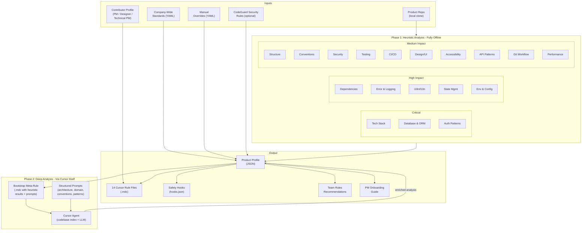
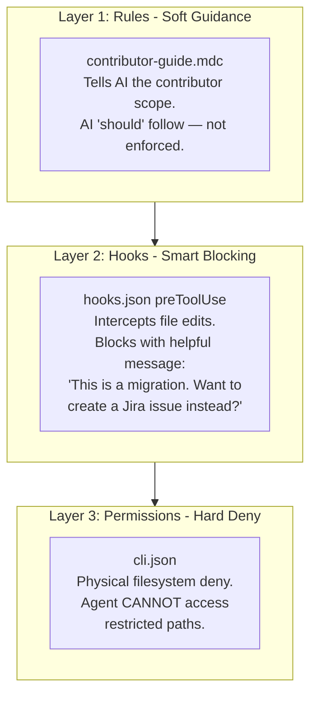
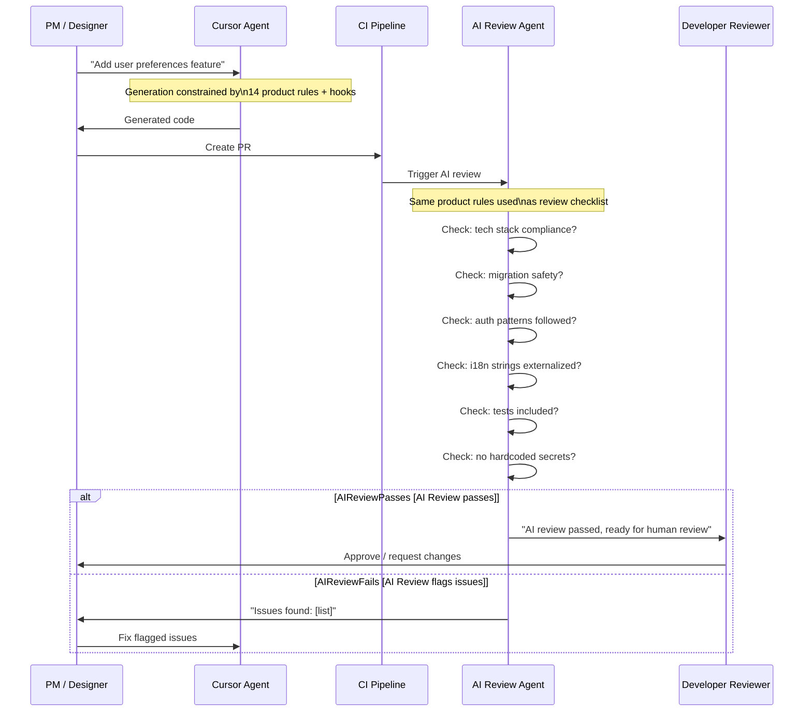

# Prompt: Generate Engineering Deep Dive Presentation

> **How to use this document:** Copy the entire content below into Claude (or another LLM) and ask it to generate a polished technical presentation. All architecture details, code examples, data models, and specifications are included — the LLM should not invent or assume any data.

---

## Instructions for the LLM

Create a detailed technical presentation for an engineering audience. This deck should be thorough — include architecture diagrams (mermaid), code snippets, YAML/JSON examples, and directory trees where specified. Target 30-35 slides. The main deck covers slides 1-23; appendix slides (24+) cover advanced topics.

**Audience:** Engineers, architects, tech leads, platform team members.

**Goal:** Align on solution architecture, prepare for implementation, and surface all decision points that need engineering input.

**Tone:** Technical, precise, no hand-waving. Show the actual data structures, file formats, and CLI commands.

**Format:** One slide per section below. Code blocks should be formatted. Use mermaid syntax for diagrams. Keep each slide focused — split into two slides if content overflows.

---

## Slide 1: Title

**Product Builders — Engineering Deep Dive**
Architecture, Implementation Plan, and Decision Points

March 2026

---

## Slide 2: Problem Recap

- **50+ products** across diverse tech stacks (React, Java Spring, Python Django, .NET) and mixed Git platforms (GitHub, GitLab, Azure DevOps, Bitbucket)
- PMs/designers want to contribute code via Cursor AI agents
- AI must produce code that is **fully compatible** with each product's architecture, conventions, security, and quality standards
- No existing tool solves this — we need our own (see next slide)
- **Success metric:** PM-authored PRs pass CI and AI review on first attempt at **80%+ rate**

---

## Slide 3: Research Findings — Existing Tools

We evaluated 5 existing tools. Each solves part of the problem but none covers the full scope:

| Tool | What It Does | Stars | Limitation |
|---|---|---|---|
| **Rulefy** (npm) | Uses repomix + Claude API to generate a single `.rules.mdc` | 27 | Single monolithic file; no company standards; requires Anthropic API key |
| **rules-gen** (npm) | Interactive CLI picking from a predefined rule catalog | 15 | Static catalog, not codebase analysis |
| **Repomix** (npm) | Packs entire codebases into AI-friendly text | 21k+ | Building block, not a rule generator |
| **CodeGuard / CoSAI** (Python) | Security rules framework; translates to Cursor, Windsurf, Copilot formats | 389 | Security-only, not product-specific. Excellent architecture pattern. |
| **stack-analyzer** (Python) | Detects languages, frameworks, build tools from repos | 4 | Limited scope, validates heuristic approach |

**Why we need our own tool:**
- No tool generates multi-file, scoped rules (Cursor's recommended approach: 14 focused files, under 500 lines each)
- No tool uses Cursor itself as the deep analysis engine (all require external LLM API keys)
- No tool generates safety hooks alongside rules
- No tool supports the analyze-once-generate-for-many pattern for 50+ products
- No tool considers contributor profiles (PM vs designer vs technical PM)
- No tool handles company-wide standards layered on top of product rules

---

## Slide 4: Architecture Overview

Include this mermaid diagram:



**Two deliverables:**
- **CLI tool** (Python/Click) — analysis, generation, governance, export
- **Web application** (FastAPI + Jinja2) — documentation, onboarding, CLI distribution, product catalog

**External dependencies: NONE.** Heuristic analysis is fully local/offline. Deep analysis uses Cursor itself — no LLM API keys.

---

## Slide 5: End-to-End Workflow

Include this mermaid sequence diagram:

```mermaid
sequenceDiagram
  participant PlatformTeam as Platform Team
  participant Tool as Product Builders CLI
  participant Cursor as Cursor IDE
  participant PM as PM / Designer
  participant DevReview as Dev Reviewer

  rect rgb(40, 40, 60)
  note right of PlatformTeam: One-time setup per product
  PlatformTeam->>Tool: analyze /path/to/repo --name "product-x"
  Tool->>Tool: Phase 1: Run 18 heuristic analyzers
  Tool->>Tool: Generate Product Profile (JSON)
  Tool->>Tool: Generate bootstrap meta-rule + prompts
  Tool->>Tool: Generate initial .mdc rules + hooks
  PlatformTeam->>Cursor: Open product repo with bootstrap rule
  Cursor->>Cursor: Phase 2: Deep analysis via agent
  Cursor->>Cursor: Enrich and finalize rule files
  PlatformTeam->>Tool: export --name "product-x" --target /repo
  Tool->>Tool: Copy .cursor/rules/ + hooks.json to product repo
  end

  rect rgb(40, 60, 40)
  note right of PM: Day-to-day PM/Designer workflow
  PM->>Cursor: Open product repo (rules auto-loaded)
  PM->>Cursor: "Add user preferences feature"
  Cursor->>Cursor: Agent constrained by 14 rules
  Cursor->>Cursor: Hooks block dangerous operations
  Cursor->>PM: Code generated (compatible with product)
  PM->>PM: Create PR
  PM->>DevReview: PR review request
  DevReview->>DevReview: Review AI-generated code
  DevReview->>PM: Approve / request changes
  end

  rect rgb(60, 40, 40)
  note right of PlatformTeam: Ongoing maintenance
  PlatformTeam->>Tool: Re-analyze after major releases
  DevReview->>Tool: Flag inaccurate rules (feedback)
  Tool->>Tool: Regenerate with updated templates/overrides
  end
```



---

## Slide 6: Two-Phase Analysis

**Phase 1 — Heuristic Analysis (fully local, fast)**
- 18 analyzers run against the local repo clone
- Detects: languages, frameworks, ORM, auth patterns, dependencies, linters, CI/CD, directory structure, etc.
- Output: `ProductProfile` (JSON) with structured results for each dimension
- Analyzers that fail (malformed configs, missing files) produce partial results with `status: "error"` — overall analysis continues

**Phase 2 — Deep Analysis (via Cursor itself, ~10 min)**
- Tool generates a temporary bootstrap meta-rule (`.cursor/rules/analyze-and-generate.mdc`)
- Platform team runs 4 sequential steps in Cursor Chat:
  - **Step 1 — Architecture Analysis** (~2 min): Layering patterns, module boundaries, dependency direction using @codebase
  - **Step 2 — Domain Model Analysis** (~2 min): Domain entities, relationships, bounded contexts, business logic locations
  - **Step 3 — Convention Deep-Dive** (~2 min): Implicit conventions (naming philosophy, abstraction patterns, code habits)
  - **Step 4 — Generate Final Rules** (~3 min): Produces all 14 `.mdc` files with proper frontmatter, scoped globs, and micro-examples from the actual codebase
- Each step's output conforms to a defined JSON schema — structural correctness validated automatically via `generate --validate`
- Content accuracy reviewed manually by the platform team before committing

**Standalone Analysis Prompts:** For targeted re-analysis of a single dimension (e.g., after a framework upgrade), the tool generates individual prompts in `prompts/`. Product teams run these independently in Cursor without repeating the full 4-step sequence.

**Future (Phase 5):** Cursor's Background Agent API (Beta) automates the 4-step sequence for bulk re-analysis of all 50+ products.

---

## Slide 7: 18 Analysis Dimensions

**CRITICAL — Can cause data loss or security breaches:**
1. **Tech Stack** — languages (file extensions + configs), frameworks (dependency manifests), build tools, runtime versions
2. **Data Model & Database** — ORM (Hibernate, SQLAlchemy, Prisma, TypeORM, ActiveRecord, EF), migration tool (Alembic, Flyway, Knex, Django), DB type, schema naming, relationships
3. **Authentication & Authorization** — auth middleware/guards, permission/role model, token handling, protected routes, session management

**HIGH IMPACT — Breaks production functionality:**
4. **Dependencies** — core/dev deps, key libraries, version constraints
5. **Error Handling & Logging** — error strategy, logging framework (Winston, Pino, Serilog, Log4j), monitoring (Sentry, Datadog), error response format
6. **i18n/l10n** — i18n framework, translation file format, string externalization patterns
7. **State Management** — state library (Redux, Zustand, MobX, Vuex/Pinia, NgRx), data fetching (React Query, SWR, Apollo)
8. **Environment & Configuration** — .env, YAML, Vault, feature flags, Docker, env-specific patterns
9. **Git Workflow** — branch naming, commit format (Conventional Commits?), PR templates, merge strategy, release tagging. Platform-aware: GitHub, GitLab, Azure DevOps, Bitbucket.

**MEDIUM IMPACT — Quality and compliance:**
10. **Project Structure** — directory patterns, module organization, naming scheme
11. **Conventions** — linter/formatter configs, editorconfig, import ordering
12. **Security Patterns** — input validation, CORS, secrets management, CSP headers (+ CodeGuard integration)
13. **Testing** — framework, naming, fixtures, mocking, coverage
14. **CI/CD** — pipeline platform, build steps, deployment targets, required checks
15. **Design/UI** — CSS methodology, component library, design tokens, responsive patterns
16. **Accessibility** — WCAG level, a11y tools, ARIA patterns, semantic HTML, keyboard nav, color contrast
17. **API Patterns** — REST vs GraphQL vs gRPC, route structure, request/response, OpenAPI
18. **Performance** — caching, lazy loading, code splitting, N+1 prevention, bundle size

**DEEP (Cursor-assisted only):**
- Architecture & module boundaries, domain model & business logic, implicit conventions

---

## Slide 8: Generated Outputs — 14 Cursor Rule Files

Each follows Cursor's official `.mdc` format. Rules kept under 500 lines per Cursor best practices.

| Rule File | Activation | Priority | Content |
|---|---|---|---|
| `security-and-auth.mdc` | alwaysApply | **100** | Company-wide + product-specific security. Auth patterns, input validation, secrets. |
| `database.mdc` | Apply Intelligently | **90** | ORM patterns, migration safety, schema conventions. |
| `tech-stack.mdc` | alwaysApply | **85** | Allowed languages, frameworks, versions. |
| `architecture.mdc` | Apply Intelligently | **80** | Module boundaries, dependency direction, layering. |
| `error-handling.mdc` | Apply Intelligently | **75** | Logging framework, error patterns, monitoring. |
| `coding-conventions.mdc` | Specific Files (globs by language) | **70** | Naming, formatting, import ordering. |
| `contributor-guide.mdc` | alwaysApply | **65** | Git workflow, PR process, contributor scope, guided workflows. |
| `api-patterns.mdc` | Specific Files (API dirs) | **60** | Endpoint naming, HTTP methods, response format. |
| `testing.mdc` | Specific Files (test dirs) | **60** | Test framework, naming, mocks, coverage. |
| `i18n.mdc` | Apply Intelligently | **55** | String externalization, translation patterns. |
| `state-and-config.mdc` | Apply Intelligently | **50** | State management, env config, feature flags. |
| `design-system.mdc` | Specific Files (frontend) | **50** | Component patterns, styling, design tokens. |
| `accessibility.mdc` | Specific Files (frontend) | **45** | WCAG level, ARIA, semantic HTML, keyboard nav. |
| `project-overview.mdc` | alwaysApply | **40** | Product context, tech stack summary, architecture overview. |

**Priority strategy:** Safety-critical rules override all others. Structural rules follow. Convention and informational rules have lowest priority.

---

## Slide 9: Generated Outputs — Hooks and Permissions

**Safety Hooks (`.cursor/hooks.json`):**

```json
{
  "version": 1,
  "hooks": {
    "preToolUse": [
      { "command": "./.cursor/hooks/scope-check.sh", "matcher": "Write|Edit" }
    ],
    "beforeShellExecution": [
      { "command": "./.cursor/hooks/shell-guard.sh" }
    ]
  }
}
```

- `preToolUse` with matcher `Write|Edit` intercepts file edits before execution
- Hook reads `tool_input.file_path` from stdin JSON
- Returns `permissionDecision: "deny"` + `permissionDecisionReason` with helpful message
- Validated Feb 2026 — see HOOKS_RESEARCH.md
- Known caveat: ENAMETOOLONG on Windows for large files (mitigation: cli.json as fallback)

**CLI Permissions (`.cursor/cli.json`) — example for PM on React product:**

```json
{
  "permissions": {
    "allow": [
      "Read(**)",
      "Write(src/components/**)",
      "Write(src/pages/**)",
      "Write(src/styles/**)",
      "Write(src/hooks/**)",
      "Write(public/**)",
      "Shell(npm:run dev)",
      "Shell(npm:run test)",
      "Shell(git:*)"
    ],
    "deny": [
      "Write(src/api/**)",
      "Write(src/models/**)",
      "Write(src/middleware/**)",
      "Write(migrations/**)",
      "Write(prisma/**)",
      "Write(.env*)",
      "Write(docker*)",
      "Write(.github/**)",
      "Shell(rm)",
      "Shell(prisma:migrate)",
      "Shell(npm:publish)"
    ]
  }
}
```

**Additional outputs:** PM onboarding guide (markdown), AI review checklist (markdown), Team Rules recommendations (markdown).

---

## Slide 10: Three-Layer Governance — Deep Dive

Include this mermaid diagram:



**Key design: All three layers are generated from a single `scopes.yaml` file.**

Example hook deny response:
```json
{
  "permissionDecision": "deny",
  "permissionDecisionReason": "This file (migrations/001_add_users.sql) is a database migration. As a Product Manager, database schema changes require engineering team involvement. I can help you create a Jira issue describing the database change you need instead."
}
```

---

## Slide 11: Scopes System — scopes.yaml

All three enforcement layers are generated from this single configuration:

```yaml
zones:
  frontend_ui:
    paths: ["src/components/**", "src/pages/**", "src/styles/**", "public/**"]
  frontend_logic:
    paths: ["src/hooks/**", "src/utils/client/**", "src/store/**"]
  api:
    paths: ["src/api/**", "src/routes/**", "src/controllers/**"]
  backend_logic:
    paths: ["src/services/**", "src/lib/**"]
  database:
    paths: ["migrations/**", "prisma/**", "src/models/**"]
  infrastructure:
    paths: [".github/**", "docker*", "Dockerfile", "*.yml", "*.yaml"]
  security:
    paths: ["src/auth/**", "src/middleware/auth*"]
  configuration:
    paths: [".env*", "config/**"]
  tests:
    paths: ["tests/**", "**/__tests__/**", "**/*.test.*", "**/*.spec.*"]
  fixtures:
    paths: ["tests/fixtures/**", "tests/data/**", "**/__fixtures__/**"]

contributor_scopes:
  engineer:
    allowed_zones: [frontend_ui, frontend_logic, api, backend_logic, database,
                    infrastructure, security, configuration, tests, fixtures]
    read_only_zones: []
    forbidden_zones: []
  product_manager:
    allowed_zones: [frontend_ui, frontend_logic]
    read_only_zones: [api, backend_logic]
    forbidden_zones: [database, infrastructure, security, configuration]
  designer:
    allowed_zones: [frontend_ui]
    read_only_zones: [frontend_logic]
    forbidden_zones: [api, backend_logic, database, infrastructure, security, configuration]
  qa_tester:
    allowed_zones: [tests, fixtures]
    read_only_zones: [frontend_ui, frontend_logic, api, backend_logic]
    forbidden_zones: [database, infrastructure, security, configuration]
```

- Heuristic analyzers auto-detect zone paths from the project structure
- Product teams customize this file for their specific needs
- `scopes.yaml` is committed to git; hooks and permissions are generated locally (gitignored)

---

## Slide 12: Contributor Profiles and Setup

**5 profiles:**

| Profile | Writable Zones | Read-Only | Blocked | Hooks Behavior |
|---|---|---|---|---|
| **Engineer** | All | — | — | No scope-check hooks; cli.json unrestricted |
| **Technical PM** | frontend_ui, frontend_logic, api | backend_logic, tests | database, infra, security, config | Hooks block with helpful messages on critical ops |
| **Product Manager** | frontend_ui, frontend_logic | api, backend_logic | database, infra, security, config | Hooks block with helpful redirects |
| **Designer** | frontend_ui | frontend_logic | Everything else | Strictest permissions |
| **QA / Tester** | tests, fixtures | All production code | database, infra, security, config | Hooks block non-test changes |

**How profile assignment works:**

```bash
git clone <product-repo> && cd product-repo
product-builders setup --profile pm
```

The `setup` command:
1. Reads `scopes.yaml` (committed to git)
2. Generates profile-specific `hooks.json` and `cli.json` locally (gitignored)
3. Writes `.cursor/contributor-profile.json` (gitignored) — read by scope-check hook
4. Deploys hook scripts (`scope-check.sh`, `shell-guard.sh`) to `.cursor/hooks/` (gitignored)

If `scopes.yaml` is missing, `setup` exits with a clear error and instructions to run `analyze` and `export` first.

---

## Slide 13: CLI Interface

```bash
# Full pipeline: heuristic analysis + bootstrap for deep analysis
product-builders analyze /path/to/repo --name "product-x"

# Heuristic-only (fast, fully offline)
product-builders analyze /path/to/repo --name "product-x" --heuristic-only

# Regenerate rules (after template/override/profile changes)
product-builders generate --name "product-x" --profile designer

# Validate rule structural correctness
product-builders generate --name "product-x" --validate

# Export rules + governance to product repo
product-builders export --name "product-x" --target /path/to/repo --profile pm

# Setup local governance for a contributor (run inside product repo)
product-builders setup --profile pm

# List all analyzed products
product-builders list

# Check for rule drift
product-builders check-drift --name "product-x" --repo /path/to/repo

# Monorepo: analyze a sub-project
product-builders analyze /path/to/monorepo --name "frontend-app" --sub-project apps/frontend

# Monorepo: auto-discover and analyze all sub-projects
product-builders bulk-analyze --monorepo /path/to/monorepo

# Bulk analyze from manifest
product-builders bulk-analyze --manifest products.yaml

# Record feedback on a rule
product-builders feedback --name "product-x" --rule "database" \
  --issue "Missing Prisma cascade delete convention"
```

---

## Slide 14: Project Structure

```
Product-Builders/
├── pyproject.toml
├── requirements.txt
├── company_standards/              # Company-wide standards (YAML)
│   ├── security.yaml
│   ├── quality.yaml
│   ├── accessibility.yaml
│   ├── performance.yaml
│   ├── git-workflow.yaml
│   ├── general.yaml
│   └── schema.yaml
├── src/
│   └── product_builders/
│       ├── cli.py                  # CLI entry point (click)
│       ├── config.py               # Configuration management
│       ├── analyzers/              # 18 heuristic analyzers
│       │   ├── base.py             # BaseAnalyzer ABC
│       │   ├── tech_stack.py
│       │   ├── database.py
│       │   ├── auth.py
│       │   └── ... (15 more)
│       ├── deep_analysis/          # Cursor-assisted analysis
│       │   ├── bootstrap.py        # Bootstrap meta-rule generator
│       │   └── prompts/            # Structured analysis prompts
│       ├── generators/             # Output generation
│       │   ├── base.py             # BaseGenerator ABC
│       │   ├── cursor_rules.py     # .mdc file generator
│       │   ├── cursor_hooks.py     # hooks.json generator
│       │   ├── onboarding.py       # Onboarding guide generator
│       │   └── templates/          # 16 Jinja2 templates
│       ├── profiles/               # Contributor profile definitions
│       │   ├── base.py             # ContributorProfile ABC
│       │   ├── designer.py
│       │   ├── product_manager.py
│       │   └── technical_pm.py
│       ├── lifecycle/              # Rule lifecycle management
│       │   ├── drift.py            # Staleness detection
│       │   ├── feedback.py         # Feedback collection
│       │   └── versioning.py       # Rule version tracking
│       └── models/
│           └── profile.py          # ProductProfile dataclass
├── profiles/                       # Generated outputs per product
│   └── {product-name}/
│       ├── analysis.json           # Raw heuristic analysis
│       ├── scopes.yaml             # Zone definitions + permissions
│       ├── overrides.yaml          # Manual overrides (optional)
│       ├── prompts/                # Deep analysis prompts
│       ├── onboarding.md
│       ├── review-checklist.md
│       └── .cursor/
│           ├── hooks.json
│           ├── cli.json
│           └── rules/ (14 .mdc files + bootstrap)
└── tests/
```

---

## Slide 15: Implementation Phases

**Delivery is incremental. First deliverable = Phase 1 + 2 + 3 for pilot products.**

**Phase 1 — Foundation:**
- Project scaffold (pyproject.toml, requirements.txt, package structure)
- ProductProfile dataclass with all 18 analysis dimensions
- BaseAnalyzer and BaseGenerator ABCs
- CLI skeleton with click (analyze, generate, setup, export, list)
- Company standards YAML schema + example files
- FastAPI webapp scaffold with Jinja2 (landing page, CLI download page)

**Phase 2 — Core Heuristic Analyzers (8 highest-impact):**
- Tech stack, database & ORM (CRITICAL), auth patterns (CRITICAL)
- Error handling & logging, project structure, dependencies, conventions, Git workflow

**Phase 3 — Rule Generation + Governance:**
- Jinja2 templates for all 14 rule types
- Three-layer governance (scopes.yaml → rules + hooks + permissions)
- setup --profile command, export command
- Bootstrap meta-rule generator (4-step deep analysis)
- Contributor profile system (5 profiles)
- Onboarding guide and review checklist generators
- Webapp: documentation pages, per-profile onboarding, product catalog

**Phase 4 — Remaining 10 Analyzers:**
- Security (+CodeGuard), testing, CI/CD, design/UI, accessibility, API, i18n, state management, env config, performance

**Phase 5 — Automation & Lifecycle:**
- Drift detection, feedback system, rule versioning, Background Agent API integration, metrics

---

## Slide 16: Rule Validation

After generation, rules are validated:

1. **Structural validation** — all 14 .mdc files have valid frontmatter (description, globs, activation type), under 500 lines, no broken references
2. **Scope consistency** — scopes.yaml zones cover all project directories (no uncategorized paths); all profiles reference valid zones
3. **Conflict check** — scan for contradictory instructions (e.g., two rules specifying different styling approaches); flag for review
4. **Prompt-based smoke test** (manual during pilot) — run predefined prompts ("add a button component", "create a new page") against rules in Cursor; verify output matches product patterns

Structural validation is built into `generate --validate`. Smoke tests are manual during pilot; automatable later via Background Agent API.

---

## Slide 17: Rule Lifecycle Management

**Initial Generation:** analyze → heuristic rules → deep analysis enrichment → platform team review → commit to repo

**Ongoing Maintenance:**
- Re-analysis triggers: major releases, framework upgrades, architecture changes
- Feedback loop: developers flag inaccurate rules during PR review → fed into next regeneration
- Template updates: improve Jinja2 templates → regenerate all products from cached profiles
- Version tracking: each rule set has version + generation timestamp

**Drift Detection (`check-drift` command):**

1. **Hash-based fingerprinting** — during analysis, fingerprint key files (dependency manifests, linter configs, CI pipelines, auth configs). Store hashes in `analysis.json`. `check-drift` compares current hashes vs stored — outputs drift score (0-100%) and lists changed dimensions.
2. **Git-based detection** — record commit SHA at analysis time. `check-drift` runs `git diff --stat` and maps changed files to analysis dimensions (e.g., `package.json` change → dependencies dimension).
3. **CI integration** — run `check-drift` as a post-merge hook on main branch. Notify platform team if drift exceeds threshold (DP-9).
4. **Scheduled bulk scan** — `bulk-check-drift --manifest products.yaml` across all 50+ products. Schedulable as cron job for proactive monitoring.

```bash
product-builders check-drift --name "product-x" --repo /path/to/repo
# Output: Drift score: 34%. Changed: dependencies (high), ci_cd (medium).
# Recommendation: re-analyze dependencies and ci_cd dimensions.
```

**Deprecation:** Rules referencing removed frameworks/patterns flagged as stale. Quarterly review recommended.

---

## Slide 18: AI Review Integration

The same product rules serve double duty — guiding AI code generation AND AI code review:



**Implementation recommendation:** Generate both machine-readable review rules (`review-checklist.md`) compatible with any AI review tool (CodeRabbit, Copilot, etc.) AND a human-readable PR checklist with auto-checkboxes. Tool selection is DP-2.

---

## Slide 19: Shared Libraries & Cross-Product Awareness

Beyond design systems, products share internal libraries (auth clients, API wrappers, logging, etc.). The tool detects and handles these:

**Architecture:**
- `shared_components/` directory in Product-Builders repo: YAML files describing each shared library (package name, version, API conventions, usage patterns)
- During analysis, the tool detects which shared packages a product uses (from dependency manifests)
- An additional rule file (`shared-libraries.mdc`) is auto-included for products that consume shared libraries
- Ensures AI uses the shared library's API correctly and doesn't reinvent existing functionality

**Shared library manifest example:**

```yaml
name: "auth-client"
package_name: "@cegid/auth-client"
version: "3.x"
description: "Centralized OAuth2/OIDC client for all frontend products"

api:
  login: "AuthClient.login(provider: string) → Promise<Session>"
  logout: "AuthClient.logout() → Promise<void>"
  getSession: "AuthClient.getSession() → Session | null"
  withAuth: "withAuth(Component) → HOC that redirects unauthenticated users"

rules:
  do:
    - "Always use @cegid/auth-client for authentication — never implement custom OAuth flows"
    - "Use withAuth() HOC for protected pages"
    - "Use getSession() to access current user — never decode JWT manually"
  dont:
    - "Do NOT store tokens in localStorage — auth-client handles storage"
    - "Do NOT call identity provider APIs directly"

consumed_by: ["product-a", "product-b", "product-c"]
```

**Relationship to DP-1:** The shared library inventory (DP-1) feeds directly into this system. Until DP-1 is resolved, `shared-libraries.mdc` is not generated.

---

## Slide 20: Product Families & Grouping

With 50+ products, analyzing each independently works but misses optimization opportunities. Product families enable shared templates and cross-pollination:

**Concept:** Products are grouped by tech stack similarity. Auto-detected during bulk analysis:

| Family | Example Products | Shared Patterns |
|---|---|---|
| **React + Next.js** | ~12 products | React patterns, Next.js conventions, Tailwind CSS |
| **Java Spring** | ~8 products | Spring Boot, Maven, JPA/Hibernate |
| **Python Django** | ~5 products | Django conventions, DRF, Celery |
| **.NET Services** | ~7 products | C#, Entity Framework, Azure patterns |
| **Unique** | varies | No close match — fully product-specific rules |

**Benefits:**
- **Shared templates:** Family-level Jinja2 template variants produce more specific, higher-quality rules
- **Faster onboarding:** "This product is in the React+Next.js family" instantly conveys 80% of conventions
- **Cross-pollination:** Best practices discovered in one family member propagate to siblings
- **Efficiency:** Heuristic analyzers share detection logic within a family

**Implementation:**
- Auto-detected during bulk analysis by clustering products on tech stack fingerprints
- Families stored in `families.yaml` manifest, editable by platform team
- Family-level rule templates supplement (not replace) product-specific rules

---

## Slide 21: Decision Points — Complete List

Group by urgency:

**Decide Before Pilot:**

| # | Decision | What Needs Deciding | Impact |
|---|---|---|---|
| **DP-3** | Pilot Products | Which 2-3 products? Ideal: one frontend-only, one full-stack with DB, one using shared components | Determines analyzer priority |
| **DP-4** | Pilot Timeline | Start date, duration, success criteria for scaling | Planning |
| **DP-5** | Zone Definitions | Product teams define scopes.yaml — directory-to-zone mapping + contributor permissions. Co-create with pilot teams. | Governance accuracy |
| **DP-8** | PM Support Model | Slack channel, buddy system, office hours, FAQ, or combination? | Adoption risk |
| **DP-10** | CLI Distribution | How do PMs install `product-builders`? Options: internal PyPI, pre-built binary, pip from Git, download from webapp. | Onboarding friction |
| **DP-11** | Webapp Hosting | Where is the FastAPI webapp deployed? Internal infrastructure, Azure App Service, container? Who maintains it? | Infrastructure dependency |

**Decide During Pilot:**

| # | Decision | What Needs Deciding | Impact |
|---|---|---|---|
| **DP-1** | Shared Libraries Inventory | Which shared internal libraries exist, how distributed, which products consume them? | Determines `shared-libraries.mdc` generation |
| **DP-2** | AI Review Tool Selection | Which AI review tool to use in CI? Recommend: generate generic markdown compatible with any tool. | CI integration |
| **DP-12** | Company Standards Authorship | Who writes and maintains `company_standards/*.yaml`? Security team? Platform team? Domain owners? | Governance ownership |

**Decide Later (Phase 4-5):**

| # | Decision | What Needs Deciding | Impact |
|---|---|---|---|
| **DP-6** | Cursor Enterprise | Parked — governance doesn't depend on it. Revisit if/when available. | Additive only |
| **DP-7** | Design System Integration | Which DS exist, extraction approach, which products should adopt? | Phase 4 design analyzer |
| **DP-9** | Staleness Thresholds | What drift threshold triggers re-analysis? Who gets notified? Automated vs manual re-analysis? | Scale operations |
| **DP-13** | Product Families Strategy | Auto-detected vs manually curated families? Who maintains `families.yaml`? | Scale efficiency |
| **DP-14** | Bulk Analysis Access | For 50+ products across GitHub/GitLab/Azure DevOps/Bitbucket — who clones repos? Service account or developer machines? | Automation feasibility |
| **DP-15** | Cursor Model Assumptions | Do rules need to account for different LLM backends in Cursor (Claude vs GPT)? Test during pilot. | Rule robustness |

---

## Slide 22: Risk Register

| Risk | Impact | Probability | Mitigation |
|---|---|---|---|
| Cursor hooks API breaking changes | High | Medium | Version pinning, cursor-compatibility.yaml, feature detection, regression tests |
| PM adoption lower than expected | High | Medium | Guided first contribution, support model (DP-8), trust-building progression |
| Rule quality insufficient for 80% target | High | Medium | Rule validation, deep analysis review, feedback loop, overrides system |
| Engineer resistance to PM-authored PRs | Medium | Medium | Pilot retrospective, executive sponsorship |
| ENAMETOOLONG blocks hooks on Windows | Medium | Low | cli.json (Layer 3) as fallback; test on Windows during pilot |
| Scope creep (18 analyzers + DS + patterns + webapp) | Medium | High | Incremental delivery; Phase 1-3 is MVP; ship phase by phase |
| Monorepo complexity exceeds estimates | Medium | Low | Monorepo support is additive; single-repo path unaffected |
| Cursor deep analysis output inconsistency | Medium | Medium | Output schema validation, human review step, heuristic layer as baseline |
| Stale rules at scale (50+ products) | Medium | High | Automated drift detection (DP-9), CI integration, scheduled scans |

---

## APPENDIX — Slide 23: Company Standards YAML Format

Company-wide engineering standards are maintained as YAML files in `company_standards/`. These are merged into every product's rules during generation.

**Directory structure:**

```
company_standards/
├── security.yaml        # Security policies (authored by security team)
├── quality.yaml         # Code review and quality standards
├── accessibility.yaml   # WCAG requirements, a11y standards
├── performance.yaml     # Performance budgets and constraints
├── git-workflow.yaml    # Branch naming, commit format, PR conventions
├── general.yaml         # General engineering principles
└── schema.yaml          # JSON Schema for validating all standard files
```

**Example — `security.yaml`:**

```yaml
standard: security
version: "1.0"
last_updated: "2026-02-15"
owner: "security-team@cegid.com"

rules:
  secrets:
    - "NEVER hardcode API keys, passwords, tokens, or connection strings"
    - "Use environment variables or Vault for all secrets"
    - "Add secret patterns to .gitignore and pre-commit hooks"
  input_validation:
    - "Validate and sanitize ALL user inputs server-side"
    - "Use parameterized queries — never concatenate SQL"
    - "Apply allowlist validation for file uploads (type, size)"
  auth:
    - "Use company SSO/OAuth2 — never implement custom auth"
    - "Enforce HTTPS for all endpoints"
    - "Set secure, httpOnly, sameSite flags on cookies"
  headers:
    - "Set Content-Security-Policy headers"
    - "Set X-Content-Type-Options: nosniff"
    - "Set X-Frame-Options: DENY (unless iframe is required)"

applies_to: "all"
priority_boost: 10
```

**How standards merge with product rules:**
- Standards are injected into the relevant `.mdc` templates (e.g., `security.yaml` → `security-and-auth.mdc`)
- `priority_boost` raises the base priority of the generated rule
- `applies_to` can be `"all"` or a list of product families/names
- Product-specific overrides (`overrides.yaml`) can suppress individual standard rules with justification

---

## APPENDIX — Slide 24: Web Application Architecture

The webapp complements the CLI with documentation, onboarding, and product visibility.

**Tech stack:** FastAPI + Jinja2 templates (server-rendered, no SPA framework)

**Routes and pages:**

| Route | Page | Content |
|---|---|---|
| `/` | Landing | What is Product Builders, who is it for, quick-start links |
| `/docs` | Documentation | How it works, concepts, architecture, FAQ |
| `/docs/onboarding/:profile` | Profile Onboarding | Per-profile guides (PM, Designer, Engineer, QA, Technical PM) |
| `/products` | Product Catalog | Read-only list of analyzed products with tech stack, last analysis date, drift status |
| `/products/:name` | Product Detail | Tech stack summary, active rules, contributor profiles, last analysis |
| `/install` | CLI Installation | Download links, pip install instructions, version info |
| `/changelog` | Release Notes | Version history, template improvements, new analyzer announcements |

**Data source:** The webapp reads from `profiles/` directory (generated JSON/YAML). No database in v1 — file-based.

**Deployment (DP-11):** Intended for internal hosting. Lightweight — single Python process, no database, no background workers. Options: Azure App Service, internal Docker host, or VM.

---

## APPENDIX — Slide 25: Testing Strategy for Product Builders

How the Product Builders tool itself is tested:

**Unit Tests (`tests/test_analyzers/`):**
- Each of the 18 analyzers tested against fixture repos (minimal repos with known tech stacks)
- Verify correct detection: e.g., `test_tech_stack.py` feeds a repo with `package.json` + `tsconfig.json` → expects `{"languages": ["typescript"], "frameworks": ["react", "next.js"]}`
- Verify graceful failure: malformed configs produce `status: "error"` with partial results, not crashes
- Fixtures organized by tech stack family (React, Spring, Django, .NET)

**Unit Tests (`tests/test_generators/`):**
- Verify generated `.mdc` files have valid frontmatter (description, globs, activation type)
- Verify all 14 rules stay under 500 lines
- Verify `hooks.json` and `cli.json` conform to Cursor's expected schema
- Verify scopes.yaml → hooks/permissions mapping is consistent (no allowed zone blocked by permissions)

**Integration Tests (`tests/test_integration/`):**
- End-to-end: `analyze` → `generate` → `export` on sample repos → verify output directory structure
- Profile-specific: generate for PM vs Engineer → verify different hooks.json and cli.json content
- Monorepo: analyze sub-projects → verify namespaced rules and merged exports

**Smoke Tests (manual during pilot, automated later):**
- Run predefined prompts against generated rules in Cursor
- Verify AI output matches product patterns
- Track regression: after template changes, re-run smoke suite
- Automatable via Background Agent API (Phase 5)

**Cursor Compatibility Tests:**
- After major Cursor releases, run full suite on pilot products
- Verify hooks still intercept correctly, cli.json still enforces, .mdc frontmatter still parsed

---

## APPENDIX — Slide 26: Design System Analysis

**Two-stage approach:**

**Stage 1 — Analyze the DS itself (run once per DS, re-run on DS releases):**
- Extract components, props/API, design tokens, composition patterns, guidelines
- Output: `design-system-manifest.yaml`
- Data sources: Storybook extraction, source repo analysis, published package types, manual curation
- Research: Existing MCP server (`mcp-design-system-extractor`) already does Storybook extraction

**Stage 2 — Per-product design analysis (part of regular product analysis):**
- Detect which DS the product uses (from dependency manifests)
- Detect product-specific components and styling approach
- Generate rules based on detected scenario

**Four scenarios:**
1. **Uses shared DS** — generates `design-system.mdc` (from DS manifest) + `product-design.mdc` (product-specific wrappers)
2. **Own design** — generates only `product-design.mdc` from scanning the repo
3. **Should adopt DS** (configurable) — generates all rules + `migration-guide.mdc` ("new components use CDS; existing follow current patterns")
4. **No structured design** — generates `product-design.mdc` with whatever patterns exist

**DS manifest format example:**

```yaml
name: "CDS (Cegid Design System)"
version: "2.3.0"
storybook_url: "https://cdsstorybookhost.z6.web.core.windows.net/storybook-host/main/"
package_name: "@cegid/cds-react"

components:
  Button:
    import_path: "@cegid/cds-react"
    props:
      variant: { type: "string", values: ["primary", "secondary", "danger", "ghost"], default: "primary" }
      size: { type: "string", values: ["sm", "md", "lg"], default: "md" }
    usage_notes: "Always use Button from CDS. Never create custom button elements."

tokens:
  colors:
    primary: "var(--cds-color-primary)"
    secondary: "var(--cds-color-secondary)"
  spacing:
    sm: "var(--cds-spacing-sm)"
    md: "var(--cds-spacing-md)"

guidelines:
  do:
    - "Always import components from @cegid/cds-react"
    - "Use design tokens for all colors, spacing, and typography"
  dont:
    - "Do NOT create custom button, input, or modal components"
    - "Do NOT hardcode color values — use tokens"
```

---

## APPENDIX — Slide 27: Frontend Patterns and User Flows

Three layers of UI guidance work together:

| Layer | What It Is | Example |
|---|---|---|
| **Design System** | Components, tokens, API | Use `<Button variant="primary">` from CDS |
| **Frontend Patterns** | How components combine | Page layout: Header + Sidebar + MainContent; forms use inline validation on blur |
| **User Flows** | Sequence of steps across screens | Create flow: List → Create button → Modal form → Submit → Toast → Refresh list |

**Frontend patterns captured:** page layout, form patterns (validation, multi-step), modal/dialog structure, list/data display, feedback (toast vs inline), loading (skeleton vs spinner), empty states.

**User flows captured:** navigation graph, task flows (create, edit, onboard), entry points, success paths (redirect, toast, refresh).

**Data sources:** code analysis, Storybook composition examples, Cursor deep analysis, optional manual curation (`frontend-patterns.yaml`, `user-flows.yaml`).

**New analyzers:** `frontend_patterns.py` and `user_flows.py` (Phase 4).

---

## APPENDIX — Slide 28: Monorepo Support

Monorepo support is **additive** — single-repo products work exactly as before.

**Problem:** Monorepos break the 1 repo = 1 product assumption. Sub-projects have their own stacks and conventions, but Cursor rules live at `.cursor/rules/` (repo root only).

**Solution:**
- `analyze --sub-project apps/frontend` scopes analysis to a sub-directory
- Auto-detection of monorepo markers: `lerna.json`, `pnpm-workspace.yaml`, `nx.json`, `turbo.json`
- Rules are namespaced: `apps--frontend--tech-stack.mdc`, `apps--backend--database.mdc`
- Sub-project rules use `Apply to Specific Files` with prefixed globs (e.g., `apps/frontend/src/components/**`)
- Shared repo-wide rules (security, git-workflow) remain unprefixed with `alwaysApply`
- `setup` merges all sub-project scopes into unified hooks.json and cli.json
- `export` merges all sub-project rules into the repo's single `.cursor/rules/`

---

## APPENDIX — Slide 29: Cursor Version Compatibility

Cursor is evolving rapidly. Hooks are in beta. Formats may change.

**Resilience strategy:**
- **Minimum version:** Pin the minimum Cursor version for hooks support (determined during pilot)
- **Version check in `setup`:** Warns if Cursor version is below minimum; rules still work, governance degrades to Layer 1 + Layer 3
- **`cursor-compatibility.yaml`:** Maps Cursor version ranges to supported features (hooks format, cli.json syntax, .mdc frontmatter). Generators adapt output based on detected version.
- **Feature detection over version numbers:** Detect feature support at runtime where possible
- **Regression testing:** After major Cursor releases, run smoke test suite on pilot products

---

## APPENDIX — Slide 30: Cursor Enterprise Features (Not Required)

All governance uses project-level files. No Cursor Enterprise dependency.

If Enterprise becomes available later, these features are **additive**:
- **Enforced Team Rules** (dashboard) — cannot be disabled by users
- **Sandbox Mode** — adds to our cli.json permissions
- **Audit Logs** — adds centralized logging to hook-based logging
- **Background Agent API** — enables fully automated bulk analysis

Without Enterprise, the three-layer governance (rules + hooks + permissions) provides equivalent enforcement at the project level.
